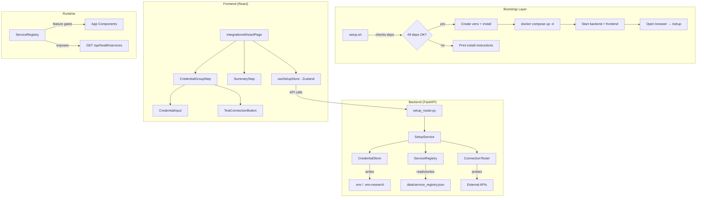

# Design Document: Easy Setup Wizard

## Overview

The Easy Setup Wizard adds a zero-friction onboarding layer to LOHI-TRADE. It consists of three coordinated pieces:

1. **`setup.sh`** — a POSIX-compatible bootstrap script that checks dependencies, spins up infrastructure, installs packages, and opens the browser to the wizard UI.
2. **Backend Setup API** — a new FastAPI router (`/api/setup/*`) that handles credential validation, persistence to `.env` files, service health probing, and the service registry.
3. **Frontend Setup Wizard** — a new React page at `/setup` (first-run) and `/settings/integrations` (returning users) that guides credential entry with explanations, skip flows, and connection testing.

The system already runs with default credentials (`admin/admin123`) and Docker infrastructure. This feature adds the *external service* configuration layer (NVIDIA NIM, Nubra.io, Broker APIs, Telegram, Ollama) on top, with graceful degradation when services are unconfigured.

### Design Decisions

| Decision | Rationale |
|----------|-----------|
| Single `setup.sh` script (no Makefile) | Lowest barrier — users run one command. POSIX-compatible for macOS + Linux. |
| Credentials stored in `.env` / `.env.research` (not DB) | Matches existing pattern. Files are gitignored. No DB dependency for secrets. |
| Service registry stored in `data/service_registry.json` | Simple JSON file, no DB migration needed. Loaded at startup, cached in memory. |
| Auth bypass for `/api/setup/*` endpoints | Setup must work before the user has logged in. Localhost-only guard provides security. |
| Existing `SetupWizardPage.tsx` repurposed | The current page handles license/account/2FA. We add a new `IntegrationsWizardPage.tsx` for the credential flow, accessible at `/setup/integrations` (first-run) and `/settings/integrations` (returning). |

---

## Architecture



### Request Flow

1. User runs `./setup.sh` → script bootstraps infrastructure → opens `http://localhost:3000/setup`
2. Frontend renders `IntegrationsWizardPage` → fetches current service status from `GET /api/setup/status`
3. User enters credentials → frontend calls `POST /api/setup/credentials/{group_id}` → backend validates format, writes to `.env`, updates registry
4. User clicks "Test Connection" → frontend calls `POST /api/setup/test/{group_id}` → backend probes external API, returns success/failure
5. User completes wizard → frontend calls `POST /api/setup/complete` → backend marks setup as done in registry
6. App reads registry at startup → disables features for unconfigured services → exposes status via `/api/health/services`

---

## Components and Interfaces

### Backend Components

#### 1. `backend-gateway/app/routers/setup.py` — Setup Router

```python
from fastapi import APIRouter, Request, HTTPException
from pydantic import BaseModel
from typing import Optional

router = APIRouter()

class CredentialSubmission(BaseModel):
    credentials: dict[str, str]  # key_name → value

class TestResult(BaseModel):
    success: bool
    response_time_ms: Optional[float] = None
    error: Optional[str] = None
    suggestion: Optional[str] = None

class ServiceStatus(BaseModel):
    group_id: str
    name: str
    status: str  # "configured" | "unconfigured" | "skipped" | "error"
    required: bool
    features_affected: list[str]

class SetupStatusResponse(BaseModel):
    setup_complete: bool
    services: list[ServiceStatus]

@router.get("/setup/status")
async def get_setup_status() -> SetupStatusResponse: ...

@router.post("/setup/credentials/{group_id}")
async def submit_credentials(group_id: str, body: CredentialSubmission, request: Request): ...

@router.post("/setup/test/{group_id}")
async def test_connection(group_id: str, request: Request) -> TestResult: ...

@router.post("/setup/skip/{group_id}")
async def skip_group(group_id: str): ...

@router.post("/setup/complete")
async def complete_setup(): ...

@router.post("/setup/reset/{group_id}")
async def reset_group(group_id: str): ...
```

#### 2. `backend-gateway/app/services/setup_service.py` — Setup Service

Orchestrates credential validation, persistence, and connection testing.

```python
class SetupService:
    def __init__(self, credential_store: CredentialStore, service_registry: ServiceRegistry):
        self.credential_store = credential_store
        self.registry = service_registry

    async def submit_credentials(self, group_id: str, credentials: dict[str, str]) -> None:
        """Validate format, write to .env, update registry."""

    async def test_connection(self, group_id: str) -> TestResult:
        """Probe external service with stored credentials."""

    async def skip_group(self, group_id: str) -> None:
        """Mark group as skipped in registry."""

    async def reset_group(self, group_id: str) -> None:
        """Clear credentials from .env, mark unconfigured."""

    def get_status(self) -> SetupStatusResponse:
        """Return current setup state."""
```

#### 3. `backend-gateway/app/services/credential_store.py` — Credential Store

Handles reading/writing `.env` and `.env.research` files.

```python
class CredentialStore:
    def __init__(self, repo_root: Path):
        self.repo_root = repo_root
        self.env_path = repo_root / ".env"
        self.env_research_path = repo_root / ".env.research"

    def write_credentials(self, group_id: str, credentials: dict[str, str]) -> None:
        """Write key=value pairs to the appropriate .env file."""

    def read_credentials(self, group_id: str) -> dict[str, str]:
        """Read current values for a group (returns empty strings for unset keys)."""

    def clear_credentials(self, group_id: str) -> None:
        """Remove/blank credential keys for a group."""

    def ensure_gitignore(self) -> bool:
        """Verify .env files are in .gitignore; add if missing. Returns True if modified."""

    def set_file_permissions(self) -> None:
        """chmod 600 on .env files (Unix only)."""
```

#### 4. `backend-gateway/app/services/service_registry.py` — Service Registry

Tracks configuration state and feature dependencies.

```python
from dataclasses import dataclass
from enum import Enum

class ServiceStatus(str, Enum):
    CONFIGURED = "configured"
    UNCONFIGURED = "unconfigured"
    SKIPPED = "skipped"
    ERROR = "error"

@dataclass
class CredentialGroup:
    group_id: str
    name: str
    description: str
    required: bool
    env_file: str  # ".env" or ".env.research"
    credential_keys: list[str]
    validation_patterns: dict[str, str]  # key → regex pattern
    documentation_url: str
    tooltip_hints: dict[str, str]  # key → hint text
    features_dependent: list[str]

class ServiceRegistry:
    GROUPS: list[CredentialGroup]  # Static definition of all credential groups

    def __init__(self, registry_path: Path):
        self.registry_path = registry_path
        self._state: dict[str, ServiceStatus] = {}
        self._load()

    def get_status(self, group_id: str) -> ServiceStatus: ...
    def set_status(self, group_id: str, status: ServiceStatus) -> None: ...
    def get_all_statuses(self) -> dict[str, ServiceStatus]: ...
    def get_available_features(self) -> dict[str, bool]: ...
    def is_feature_available(self, feature: str) -> bool: ...
    def _load(self) -> None: ...
    def _save(self) -> None: ...
```

#### 5. `backend-gateway/app/services/connection_tester.py` — Connection Tester

Probes external services to validate credentials.

```python
class ConnectionTester:
    async def test_nvidia_nim(self, api_key: str) -> TestResult:
        """GET https://integrate.api.nvidia.com/v1/models with Bearer token."""

    async def test_nubra(self, phone: str, mpin: str, totp_secret: str) -> TestResult:
        """Attempt Nubra.io login handshake."""

    async def test_broker_shoonya(self, api_key: str, client_id: str) -> TestResult:
        """Validate Shoonya credentials."""

    async def test_telegram(self, bot_token: str) -> TestResult:
        """GET https://api.telegram.org/bot{token}/getMe."""

    async def test_ollama(self) -> TestResult:
        """GET http://localhost:11434/api/tags (local Ollama)."""
```

### Frontend Components

#### 1. `src/pages/IntegrationsWizardPage.tsx`

The main wizard page. Used at `/setup/integrations` (first-run, no auth required) and `/settings/integrations` (authenticated).

```typescript
interface IntegrationsWizardPageProps {
  mode: 'first-run' | 'settings';  // Controls layout and navigation
}
```

#### 2. `src/components/setup/CredentialGroupStep.tsx`

Renders a single credential group with inputs, explanations, and actions.

```typescript
interface CredentialGroupStepProps {
  group: CredentialGroupDef;
  status: ServiceStatus;
  onSubmit: (credentials: Record<string, string>) => Promise<void>;
  onSkip: () => void;
  onTest: () => Promise<TestResult>;
}
```

#### 3. `src/components/setup/CredentialInput.tsx`

A masked input with reveal toggle and tooltip.

```typescript
interface CredentialInputProps {
  label: string;
  name: string;
  value: string;
  onChange: (value: string) => void;
  tooltipHint: string;
  error?: string;
  pattern?: string;
}
```

#### 4. `src/components/setup/SetupSummary.tsx`

Final summary showing configured/skipped services and affected features.

#### 5. `src/components/setup/ServiceStatusBanner.tsx`

Inline banner shown on pages with unconfigured service dependencies.

#### 6. `src/stores/setup-store.ts` — Zustand Store

```typescript
interface SetupState {
  services: ServiceStatus[];
  currentStep: number;
  setupComplete: boolean;
  loading: boolean;
  error: string | null;
}

interface SetupActions {
  fetchStatus: () => Promise<void>;
  submitCredentials: (groupId: string, credentials: Record<string, string>) => Promise<void>;
  testConnection: (groupId: string) => Promise<TestResult>;
  skipGroup: (groupId: string) => Promise<void>;
  resetGroup: (groupId: string) => Promise<void>;
  completeSetup: () => Promise<void>;
}
```

### Auth Bypass for Setup Endpoints

The existing `JWTAuthMiddleware` does not reject unauthenticated requests — it only sets `request.state.user_id` when a valid token is present. Individual route dependencies enforce 401. Since the setup router won't use auth dependencies, it's already accessible without a token.

Additional security: the setup router will check that the request originates from localhost (loopback IP) via a dependency:

```python
from fastapi import Depends, HTTPException, Request

def require_localhost(request: Request):
    """Reject requests not from loopback address."""
    client_host = request.client.host if request.client else None
    if client_host not in ("127.0.0.1", "::1", "localhost"):
        raise HTTPException(status_code=403, detail="Setup endpoints are localhost-only")
    return True
```

### Routing Integration

**Frontend (`main.tsx`):**
- Add route: `<Route path="/setup/integrations" element={<IntegrationsWizardPage mode="first-run" />} />`
- Add authenticated route: `<Route path="settings/integrations" element={<IntegrationsWizardPage mode="settings" />} />`

**Backend (`main.py`):**
- Add: `app.include_router(setup.router, prefix="/api", tags=["setup"])`

---

## Data Models

### Service Registry JSON (`data/service_registry.json`)

```json
{
  "setup_complete": false,
  "completed_at": null,
  "services": {
    "nvidia_nim": { "status": "unconfigured", "updated_at": null },
    "nubra": { "status": "unconfigured", "updated_at": null },
    "broker_shoonya": { "status": "unconfigured", "updated_at": null },
    "broker_angelone": { "status": "unconfigured", "updated_at": null },
    "telegram": { "status": "unconfigured", "updated_at": null },
    "ollama": { "status": "unconfigured", "updated_at": null }
  }
}
```

### Credential Group Definitions (static, in code)

```python
CREDENTIAL_GROUPS = [
    CredentialGroup(
        group_id="nvidia_nim",
        name="NVIDIA NIM",
        description="Cloud AI inference for research analysis. Powers the Research Dashboard's LLM capabilities.",
        required=False,  # Ollama is an alternative
        env_file=".env.research",
        credential_keys=["NVIDIA_NIM_API_KEY"],
        validation_patterns={"NVIDIA_NIM_API_KEY": r"^nvapi-[A-Za-z0-9_-]{20,}$"},
        documentation_url="https://build.nvidia.com",
        tooltip_hints={"NVIDIA_NIM_API_KEY": "Find this in your NVIDIA NIM dashboard under API Keys → Generate Key"},
        features_dependent=["research_dashboard", "ai_analysis"],
    ),
    CredentialGroup(
        group_id="nubra",
        name="Nubra.io",
        description="Exchange-sourced NSE/BSE market data feed. Required for live market data and real-time quotes.",
        required=True,
        env_file=".env",
        credential_keys=["NUBRA_PHONE_NO", "NUBRA_MPIN", "NUBRA_TOTP_SECRET"],
        validation_patterns={
            "NUBRA_PHONE_NO": r"^\d{10}$",
            "NUBRA_MPIN": r"^\d{4,6}$",
            "NUBRA_TOTP_SECRET": r"^[A-Z2-7]{16,}$",
        },
        documentation_url="https://nubra.io",
        tooltip_hints={
            "NUBRA_PHONE_NO": "Your registered mobile number on Nubra.io",
            "NUBRA_MPIN": "4-6 digit MPIN set during Nubra.io registration",
            "NUBRA_TOTP_SECRET": "Base32 TOTP secret from Nubra.io 2FA setup",
        },
        features_dependent=["live_market_data", "real_time_quotes"],
    ),
    CredentialGroup(
        group_id="broker_shoonya",
        name="Shoonya (Finvasia) Broker",
        description="Primary broker for order execution. Required for live trading (paper trading works without it).",
        required=False,
        env_file=".env",
        credential_keys=["SHOONYA_API_KEY", "SHOONYA_CLIENT_ID", "SHOONYA_PASSWORD"],
        validation_patterns={
            "SHOONYA_API_KEY": r"^.{8,}$",
            "SHOONYA_CLIENT_ID": r"^[A-Z0-9]{4,}$",
            "SHOONYA_PASSWORD": r"^.{4,}$",
        },
        documentation_url="https://shoonya.finvasia.com/api-documentation",
        tooltip_hints={
            "SHOONYA_API_KEY": "API key from Shoonya developer portal",
            "SHOONYA_CLIENT_ID": "Your Shoonya trading account client ID",
            "SHOONYA_PASSWORD": "Your Shoonya account password",
        },
        features_dependent=["live_trading", "order_execution"],
    ),
    CredentialGroup(
        group_id="telegram",
        name="Telegram Bot",
        description="Trade notifications and alerts via Telegram. Optional — alerts also appear in the web UI.",
        required=False,
        env_file=".env",
        credential_keys=["TELEGRAM_BOT_TOKEN", "TELEGRAM_CHAT_ID"],
        validation_patterns={
            "TELEGRAM_BOT_TOKEN": r"^\d+:[A-Za-z0-9_-]{35,}$",
            "TELEGRAM_CHAT_ID": r"^-?\d+$",
        },
        documentation_url="https://core.telegram.org/bots#how-do-i-create-a-bot",
        tooltip_hints={
            "TELEGRAM_BOT_TOKEN": "Token from @BotFather after creating your bot",
            "TELEGRAM_CHAT_ID": "Your chat/group ID (use @userinfobot to find it)",
        },
        features_dependent=["telegram_notifications"],
    ),
    CredentialGroup(
        group_id="ollama",
        name="Ollama (Local AI)",
        description="Run AI models locally without cloud API keys. Alternative to NVIDIA NIM for research features.",
        required=False,
        env_file=".env.research",
        credential_keys=[],  # No credentials — just needs Ollama running
        validation_patterns={},
        documentation_url="https://ollama.ai",
        tooltip_hints={},
        features_dependent=["research_dashboard_local", "ai_analysis_local"],
    ),
]
```

### Feature Dependency Map

```python
FEATURE_DEPENDENCIES: dict[str, list[str]] = {
    "research_dashboard": ["nvidia_nim|ollama"],  # Either satisfies
    "ai_analysis": ["nvidia_nim|ollama"],
    "live_market_data": ["nubra"],
    "real_time_quotes": ["nubra"],
    "live_trading": ["broker_shoonya|broker_angelone"],
    "order_execution": ["broker_shoonya|broker_angelone"],
    "telegram_notifications": ["telegram"],
}
```

The `|` operator means "any one of these groups being configured satisfies the dependency."

---

## Correctness Properties

*A property is a characteristic or behavior that should hold true across all valid executions of a system — essentially, a formal statement about what the system should do. Properties serve as the bridge between human-readable specifications and machine-verifiable correctness guarantees.*

### Property 1: Credential validation correctness

*For any* credential value and its associated validation pattern, the validator SHALL return a validation error if and only if the value does not match the expected regex pattern (including rejecting empty strings for required fields).

**Validates: Requirements 2.4**

### Property 2: Service registry state round-trip

*For any* valid service registry state (a mapping of group IDs to statuses), serializing to JSON and deserializing back SHALL produce an equivalent state with all group statuses preserved.

**Validates: Requirements 3.4**

### Property 3: Service status rendering completeness

*For any* valid service registry state, the rendered service status list (whether in the summary page or the settings/integrations page) SHALL contain an entry for every registered credential group with its correct current status.

**Validates: Requirements 3.6, 8.2**

### Property 4: Feature availability correctness

*For any* subset of configured services, the feature availability map SHALL mark a feature as available if and only if at least one of its dependency groups is in "configured" status.

**Validates: Requirements 4.1**

### Property 5: Health endpoint completeness

*For any* valid service registry state, the `/api/health/services` response SHALL contain an entry for every registered service with its correct configured/available status and the list of features it affects.

**Validates: Requirements 4.6**

### Property 6: Credential persistence round-trip

*For any* valid set of credentials (key-value pairs where keys are valid environment variable names and values are non-empty strings), writing them to the appropriate `.env` file and then reading them back SHALL produce equivalent key-value pairs.

**Validates: Requirements 5.1**

### Property 7: Failed reconnection rollback

*For any* credential update where the subsequent connection test fails, the credential store SHALL retain the previous credential value unchanged (the new value is not persisted until connection succeeds or user confirms).

**Validates: Requirements 8.5**

### Property 8: Port conflict detection

*For any* port in the required set {5432, 6379, 8000, 3000} that is occupied by another process, the setup script's port-check function SHALL detect the conflict and return the port number and conflicting process information.

**Validates: Requirements 9.5**

---

## Error Handling

### Backend Error Scenarios

| Scenario | Response | User-Facing Message |
|----------|----------|---------------------|
| Invalid credential format | 422 + field errors | "NVIDIA_NIM_API_KEY must start with 'nvapi-'" |
| Connection test timeout (>10s) | 504 | "Service unreachable — check your network or try again later" |
| Connection test auth failure | 200 + `success: false` | "Authentication failed — verify your API key is active" |
| .env file write failure (permissions) | 500 | "Cannot write to .env — check file permissions" |
| Non-localhost request to setup API | 403 | "Setup endpoints are only accessible from localhost" |
| Registry file corrupted | Auto-recreate | Log warning, reset to defaults |
| External service rate-limited | 429 | "Service rate-limited — wait 60 seconds and retry" |

### Frontend Error Handling

- **Network errors**: Show toast with retry button. Don't lose form state.
- **Validation errors**: Inline red text below the offending field.
- **Connection test failures**: Show error in-place with suggested fix. Allow "proceed anyway" with warning badge.
- **Partial setup**: Store progress in registry. User can resume from any step.

### Graceful Degradation Behavior

When a feature is unavailable due to unconfigured services:
1. Navigation item remains visible but shows a subtle "unconfigured" badge
2. Clicking the item shows a full-page banner: "This feature requires [Service Name]. [Configure now →]"
3. The banner links directly to `/settings/integrations` with the relevant group pre-expanded
4. No crashes, no blank pages, no cryptic errors

---

## Testing Strategy

### Property-Based Tests (Hypothesis — Python backend)

The backend logic (credential validation, service registry, .env persistence, feature gating) is well-suited for property-based testing. These are pure functions with clear input/output behavior and large input spaces.

- **Library**: `hypothesis` (already in use — `.hypothesis/` directory exists)
- **Minimum iterations**: 100 per property
- **Tag format**: `# Feature: easy-setup-wizard, Property {N}: {title}`

Each correctness property above maps to one property-based test:
1. `test_credential_validation_correctness` — generates random strings, verifies validator matches regex
2. `test_service_registry_round_trip` — generates random registry states, verifies serialize/deserialize identity
3. `test_service_status_rendering_completeness` — generates random states, verifies all groups appear in output
4. `test_feature_availability_correctness` — generates random configured subsets, verifies feature map
5. `test_health_endpoint_completeness` — generates random states, verifies API response shape
6. `test_credential_persistence_round_trip` — generates random key-value pairs, verifies .env write/read
7. `test_failed_reconnection_rollback` — generates credentials + simulated failure, verifies old value retained
8. `test_port_conflict_detection` — generates occupied port scenarios, verifies detection

### Property-Based Tests (fast-check — TypeScript frontend)

- **Library**: `fast-check` (already in devDependencies)
- **Minimum iterations**: 100 per property
- Tests for Properties 3 and 4 (rendering completeness, feature availability) on the frontend side

### Unit Tests (Example-Based)

- Setup router endpoint contracts (happy path + error cases)
- Credential input masking/reveal toggle
- Skip flow navigation
- Summary page content for specific configurations
- Localhost-only guard rejection
- .gitignore verification logic

### Integration Tests

- Full wizard flow: enter credentials → test connection → complete setup
- Hot-reload: update credential → verify service reconnects
- `setup.sh` smoke test in Docker container

### Shell Script Testing

- `shellcheck` lint pass (POSIX compliance)
- Dependency detection on macOS/Linux (manual or CI matrix)
- Port conflict detection with mock occupied ports

---

## setup.sh Script Architecture

```bash
#!/usr/bin/env bash
# setup.sh — LOHI-TRADE One-Command Bootstrap
# POSIX-compatible (bash 3.2+), works on macOS + Linux

# Phases:
# 1. Detect OS and package manager
# 2. Check system dependencies (Docker, Docker Compose, Node.js 18+, Python 3.11+)
# 3. Report missing deps with platform-specific install commands
# 4. Create Python venv + install backend deps
# 5. Install frontend deps (npm ci)
# 6. Start Docker infrastructure (postgres, redis)
# 7. Wait for healthy containers (60s timeout)
# 8. Start backend gateway (uvicorn)
# 9. Start frontend dev server (vite)
# 10. Open browser to http://localhost:3000/setup/integrations
```

Key functions:
- `detect_os()` — returns `macos`, `ubuntu`, `fedora`, `arch`, `unknown`
- `check_dependency(name, min_version, check_cmd)` — returns 0 if satisfied
- `suggest_install(name, os)` — prints platform-specific install command
- `check_ports()` — verifies 5432, 6379, 8000, 3000 are free
- `wait_healthy(service, timeout)` — polls docker health status

---

## README Structure

The production-grade README will follow this structure:

```
# LOHI-TRADE

## Table of Contents
1. Project Overview
2. Architecture
3. Prerequisites
4. Quick Start
5. Manual Setup
6. Configuration Reference
7. External Services
8. Development Workflow
9. Testing
10. Deployment
11. Troubleshooting
12. Contributing
13. License
```

Key content:
- **Architecture**: ASCII diagram showing Frontend ↔ Backend Gateway ↔ Trading Engine / Research Dashboard ↔ Redis/PostgreSQL ↔ External Services
- **Quick Start**: `git clone` → `./setup.sh` → configure in browser → start trading
- **External Services**: Table with service name, purpose, required/optional, signup URL
- **Troubleshooting**: Docker issues, port conflicts, DB failures, API key errors, macOS vs Linux differences
