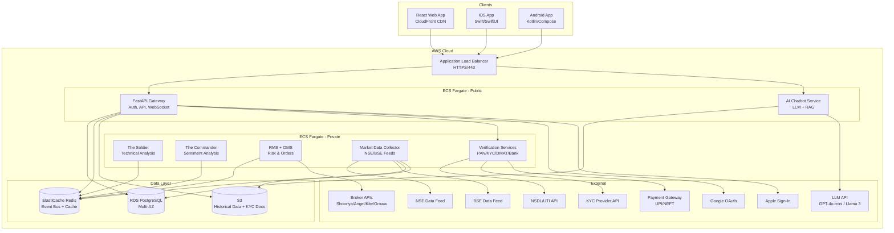

# Design Document: LOHI-TRADE Platform Expansion

## Overview

This design expands the existing LOHI-TRADE algorithmic trading system from a single-user, locally-hosted application into a multi-user, cloud-deployed platform. The existing system already provides a complete trading engine (Python/FastAPI backend, Redis event bus, SQLite/DuckDB storage, React frontend) with broker integration (Shoonya, Angel One), technical analysis (The Soldier), sentiment analysis (The Commander), risk management, order management, backtesting, and paper trading.

The expansion introduces seven major capability domains:

1. **User Lifecycle** — Account creation (Google OAuth, Apple Sign-In, email/password), PAN/KYC/DMAT verification, bank account linking, fund deposit/withdrawal, first-time onboarding walkthrough
2. **Stock Universe & Screener** — 5000+ NSE/BSE securities catalog, sector classification, custom watchlists, multi-parameter stock screener with export
3. **Native Mobile Apps** — iOS (Swift/SwiftUI) and Android (Kotlin/Jetpack Compose) with offline caching, biometric auth, push notifications
4. **Broker Expansion** — Zerodha Kite and Groww integrations, unified broker routing with failover
5. **Gen AI Chatbot** — LLM-powered conversational assistant with RAG, trading data queries, chart generation, data serialization round-trip integrity
6. **AWS Cloud Infrastructure** — ECS Fargate, RDS PostgreSQL, ElastiCache Redis, S3, CloudFront, CI/CD pipeline
7. **Market Data & Performance** — Real-time NSE/BSE feeds, order book depth, corporate actions, expanded historical data, platform-wide lightweight code optimization

### Key Design Principles

- **Lightweight & Fast**: Prefer minimal libraries, aggressive code splitting, tree-shaking, lazy loading. Target <200KB gzipped initial bundle, <200ms p95 API response times.
- **Incremental Integration**: Each expansion module plugs into the existing event-driven architecture via Redis Streams and the FastAPI gateway. No rewrites of working components.
- **Multi-Tenant Isolation**: All user data isolated via `user_id` foreign keys with PostgreSQL row-level security (RLS).
- **Regulatory Compliance**: PAN/KYC/DMAT flows follow SEBI regulations. All PII encrypted at rest (AES-256). Document retention policies enforced.
- **Offline-First Mobile**: Local SQLite cache on mobile devices with background sync. Graceful degradation when offline.
- **Cost-Effective**: Open-source LLMs (Llama 3) as chatbot option, Fargate spot for non-critical workloads, S3 lifecycle policies for storage tiering.

## Architecture

### High-Level Expansion Architecture



### Component Interaction Flow

The expansion preserves the existing event-driven flow (ticks → candles → indicators → signals → RMS → OMS) and adds new flows:

1. **Auth Flow**: Client → ALB → Gateway (JWT issuance via email/password, Google OAuth, or Apple Sign-In) → RDS (user store)
2. **Verification Flow**: Client → Gateway → Verification Services → External APIs (NSDL, KRA, Payment Gateway) → RDS (status updates)
3. **Market Data Flow**: NSE/BSE feeds → Market Data Collector → Redis Streams (existing event bus) + S3 (historical storage)
4. **Chatbot Flow**: Client → Gateway → Chatbot Service → RDS (RAG retrieval) → LLM API → Client (text + charts)
5. **Mobile Sync Flow**: Mobile App ↔ Gateway (REST + WebSocket) with local SQLite cache for offline viewing


## Components and Interfaces

### 1. Account Service (Requirement 32)

Extends the existing `auth_service.py` to support multi-user registration and social login.

```python
# backend-gateway/app/services/account_service.py

class AccountService:
    """Multi-user account creation with social login support."""

    async def register_email(self, email: str, password: str, phone: str) -> User:
        """Register via email/password. Sends OTP for verification."""

    async def login_email(self, email: str, password: str) -> TokenPair:
        """Login with email/password. Returns access + refresh tokens."""

    async def login_google(self, google_id_token: str) -> TokenPair:
        """Verify Google ID token, create/link account, return tokens."""

    async def login_apple(self, apple_auth_code: str) -> TokenPair:
        """Verify Apple auth code, create/link account, return tokens."""

    async def refresh_token(self, refresh_token: str) -> TokenPair:
        """Issue new access token (15min) from refresh token (30day)."""

    async def link_social_provider(self, user_id: str, provider: str, provider_id: str) -> None:
        """Link social provider to existing account (same email)."""

@dataclass
class TokenPair:
    access_token: str   # 15-minute expiry
    refresh_token: str  # 30-day expiry

@dataclass
class User:
    id: str
    email: str
    phone: str
    name: str
    role: UserRole  # ADMIN, TRADER, VIEWER
    is_onboarded: bool
    pan_status: VerificationStatus
    kyc_status: KYCStatus
    created_at: datetime
```

### 2. Verification Services (Requirements 1-4)

New service layer for regulatory compliance. Each verification service is stateless and communicates with external APIs.

```python
# backend-gateway/app/services/verification_service.py

class PANVerificationService:
    """PAN card verification against NSDL/UTI."""

    def validate_format(self, pan: str) -> bool:
        """Validate PAN format: [A-Z]{5}[0-9]{4}[A-Z]{1}."""

    async def verify_pan(self, user_id: str, pan: str) -> PANVerificationResult:
        """Verify PAN against NSDL/UTI API. Retries 3x with exponential backoff."""

    def mask_pan(self, pan: str) -> str:
        """Mask PAN: AB******Z1."""

    def encrypt_pan(self, pan: str) -> bytes:
        """AES-256 encrypt PAN for storage."""

class KYCService:
    """KYC verification via DigiLocker/KRA."""

    async def submit_kyc(self, user_id: str, documents: KYCDocuments) -> KYCSubmissionResult:
        """Submit KYC documents. Validates image quality first."""

    def validate_document_quality(self, image: bytes, mime_type: str) -> bool:
        """Check: 300+ DPI, 100KB-5MB, JPEG/PNG."""

    async def check_kyc_status(self, user_id: str) -> KYCStatus:
        """Poll KYC provider for verification status."""

class DMATService:
    """DMAT account linking via CDSL/NSDL."""

    def validate_dmat_format(self, account_number: str) -> tuple[bool, str]:
        """Validate CDSL (16-digit) or NSDL (IN + 14 alphanum) format. Returns (valid, depository)."""

    async def verify_dmat(self, user_id: str, account_number: str) -> DMATVerificationResult:
        """Verify DMAT account against depository API."""

    async def unlink_dmat(self, user_id: str, dmat_id: str) -> bool:
        """Unlink DMAT. Fails if open positions exist."""

class BankAccountService:
    """Bank account registration and fund management."""

    async def register_bank_account(self, user_id: str, details: BankAccountDetails) -> BankAccount:
        """Register bank account. Validates IFSC, initiates penny drop."""

    async def verify_penny_drop(self, user_id: str, bank_id: str) -> bool:
        """Confirm penny drop verification result."""

    async def initiate_deposit(self, user_id: str, amount: Decimal, method: PaymentMethod) -> DepositTransaction:
        """Initiate deposit via UPI/NetBanking/NEFT. Min ₹100, Max ₹10,00,000."""

    async def initiate_withdrawal(self, user_id: str, amount: Decimal, bank_id: str) -> WithdrawalTransaction:
        """Initiate withdrawal. Checks withdrawable balance. Min ₹100, daily max ₹25,00,000."""

    async def get_withdrawable_balance(self, user_id: str) -> Decimal:
        """Total balance minus margin blocked for open positions."""
```

### 3. Stock Universe Service (Requirements 7-9)

New service managing the complete NSE/BSE securities catalog.

```python
# backend-gateway/app/services/stock_universe_service.py

class StockUniverseService:
    """Manages 5000+ NSE/BSE securities catalog."""

    async def search_securities(self, query: str, limit: int = 20) -> list[Security]:
        """Full-text search by symbol, name, or ISIN. Target <200ms."""

    async def list_securities(
        self, exchange: str = None, sector: str = None,
        market_cap: str = None, page: int = 1, page_size: int = 50
    ) -> PaginatedResult[Security]:
        """Paginated listing with filters."""

    async def get_sector_aggregate(self, sector: str) -> SectorAggregate:
        """Sector-level: total market cap, stock count, top gainers/losers."""

    async def refresh_catalog(self) -> int:
        """Daily refresh from NSE/BSE. Returns count of updated securities."""

class WatchlistService:
    """Custom watchlist management. Max 20 lists, 100 securities each."""

    async def create_watchlist(self, user_id: str, name: str) -> Watchlist:
    async def add_security(self, user_id: str, watchlist_id: str, symbol: str) -> bool:
    async def remove_security(self, user_id: str, watchlist_id: str, symbol: str) -> bool:
    async def get_watchlist_with_prices(self, user_id: str, watchlist_id: str) -> WatchlistWithPrices:
        """Returns watchlist securities with live LTP, change%, volume. Target <500ms."""
    async def get_prebuilt_watchlists(self) -> list[Watchlist]:
        """Nifty 50, Nifty Bank, Nifty IT, Nifty Pharma, Nifty Next 50."""
```

### 4. Screener Engine (Requirements 10-11)

```python
# backend-gateway/app/services/screener_service.py

class ScreenerEngine:
    """Stock screener with fundamental + technical filters."""

    async def screen(self, filters: ScreenerFilters, sort_by: str, order: str, page: int) -> ScreenerResult:
        """Apply filters with AND logic. Returns paginated, sorted results. Target <2s."""

    async def save_preset(self, user_id: str, name: str, filters: ScreenerFilters) -> ScreenerPreset:
        """Save custom preset. Max 10 per user."""

    async def get_prebuilt_templates(self) -> list[ScreenerPreset]:
        """High Dividend Yield, Undervalued Large Caps, Momentum, Low PE Growth, 52-Week Breakout."""

    async def export_csv(self, filters: ScreenerFilters, sort_by: str) -> bytes:
        """Export all matching results as CSV."""

@dataclass
class ScreenerFilters:
    # Fundamental
    pe_ratio: Optional[Range] = None
    pb_ratio: Optional[Range] = None
    market_cap: Optional[Range] = None
    dividend_yield: Optional[Range] = None
    eps: Optional[Range] = None
    roe: Optional[Range] = None
    debt_to_equity: Optional[Range] = None
    revenue_growth_1y: Optional[Range] = None
    revenue_growth_3y: Optional[Range] = None
    profit_growth_1y: Optional[Range] = None
    profit_growth_3y: Optional[Range] = None
    # Technical
    rsi_14: Optional[Range] = None
    near_52w_high: Optional[bool] = None
    near_52w_low: Optional[bool] = None
    ma_crossover_50_200: Optional[str] = None  # "golden" or "death"
    avg_volume: Optional[Range] = None
    price_change_1d: Optional[Range] = None
    price_change_1w: Optional[Range] = None
    price_change_1m: Optional[Range] = None
    price_change_3m: Optional[Range] = None
    price_change_6m: Optional[Range] = None
    price_change_1y: Optional[Range] = None
    price_change_3y: Optional[Range] = None
    price_change_5y: Optional[Range] = None
    # Returns
    return_1y: Optional[Range] = None
    cagr_3y: Optional[Range] = None
    cagr_5y: Optional[Range] = None
    # Meta
    exchange: Optional[str] = None
    sector: Optional[str] = None
    market_cap_category: Optional[str] = None

@dataclass
class Range:
    min: Optional[float] = None
    max: Optional[float] = None
```

### 5. Broker Integration Service — Expanded (Requirements 15-17)

Extends the existing `BrokerInterface` ABC with Zerodha Kite and Groww implementations.

```python
# src/ingestion/kite_broker.py

class KiteBroker(BrokerInterface):
    """Zerodha Kite Connect API v3 implementation."""

    def connect(self, credentials: BrokerCredentials) -> bool:
        """OAuth2 login flow via Kite Connect."""

    def place_order(self, order: Order) -> str:
        """Map internal order to Kite params: exchange, tradingsymbol, transaction_type, etc."""

    def _poll_order_status(self, broker_order_id: str, interval: float = 1.0) -> Order:
        """Poll every 1s until terminal state (COMPLETE, CANCELLED, REJECTED)."""

    def _refresh_token_daily(self) -> None:
        """Refresh Kite access token at 8:30 AM IST (tokens expire daily)."""

# src/ingestion/groww_broker.py

class GrowwBroker(BrokerInterface):
    """Groww trading API implementation."""

    def connect(self, credentials: BrokerCredentials) -> bool:
        """OAuth2 login flow via Groww."""

    def place_order(self, order: Order) -> str:
        """Map internal order to Groww API params. Supports MARKET, LIMIT, SL."""

    def get_holdings(self) -> list[dict]:
        """Fetch portfolio holdings for reconciliation."""

# src/ingestion/broker_router.py

class BrokerRouter:
    """Unified broker routing with failover."""

    def __init__(self, registry: dict[str, BrokerInterface]):
        """Registry: {shoonya, angelone, kite, groww} → BrokerInterface instances."""

    async def route_order(self, user_id: str, order: Order) -> str:
        """Route to user's primary broker. Failover to backup on API unavailability."""

    def get_broker_status(self, broker_name: str) -> BrokerConnectionStatus:
        """connected, disconnected, or token_expired."""
```

### 6. AI Chatbot Service (Requirements 18-21)

New microservice for the Gen AI conversational assistant.

```python
# backend-gateway/app/services/chatbot_service.py

class ChatbotService:
    """Gen AI chatbot with RAG over user trading data."""

    def __init__(self, llm_client: LLMClient, db: AsyncSession, chart_gen: ChartGenerator):
        self.llm = llm_client
        self.db = db
        self.chart_gen = chart_gen
        self.sessions: dict[str, list[Message]] = {}  # user_id → conversation (max 20 exchanges)

    async def chat(self, user_id: str, message: str) -> ChatResponse:
        """Process user message. RAG retrieval → LLM → optional chart generation."""

    async def _retrieve_context(self, user_id: str, query: str) -> RAGContext:
        """Query user's trades, sentiment logs, signal history for relevant context."""

    async def _generate_chart(self, chart_type: str, data: dict) -> str:
        """Generate SVG/PNG chart. Types: equity_curve, daily_pnl, strategy_comparison, candlestick."""

    def serialize_query_results(self, results: list[dict]) -> str:
        """Serialize trade query results to JSON for LLM context."""

    def deserialize_llm_response(self, response_json: str, expected_type: type) -> Any:
        """Deserialize LLM structured response back to typed objects."""

    def validate_numeric_accuracy(self, llm_values: dict, db_values: dict, tolerance: float = 0.01) -> bool:
        """Validate LLM response numeric values match DB within tolerance."""

class LLMClient:
    """Lightweight LLM API wrapper. Supports OpenAI GPT-4o-mini and Llama 3."""

    async def complete(self, messages: list[Message], max_tokens: int = 1024) -> str:
        """Send messages to LLM API. Target <5s for text, <10s with charts."""

class ChartGenerator:
    """Lightweight chart generation using matplotlib (backend only, no heavy JS charting)."""

    def equity_curve(self, data: list[EquityCurvePoint], theme: str) -> bytes:
        """Generate equity curve SVG. Theme-aware (dark/light)."""

    def daily_pnl_bar(self, data: list[DailyPnL], theme: str) -> bytes:
    def strategy_comparison(self, data: list[StrategyMetrics], theme: str) -> bytes:
    def candlestick(self, ohlcv: list[dict], indicators: list[str], theme: str) -> bytes:
```

### 7. Market Data Collector (Requirements 25-28)

New service for real-time NSE/BSE data collection.

```python
# src/ingestion/market_data_collector.py

class MarketDataCollector:
    """Collects real-time and historical data from NSE/BSE official feeds."""

    async def connect_nse_feed(self) -> None:
        """Connect to NSE data feed. Publish updates to Redis within 50ms."""

    async def connect_bse_feed(self) -> None:
        """Connect to BSE data feed. Fallback source for BSE-only securities."""

    async def collect_order_book(self, symbols: list[str]) -> dict[str, OrderBookDepth]:
        """Top 5 bid/ask levels for watchlist securities."""

    async def detect_price_discrepancy(self, symbol: str, nse_price: float, bse_price: float) -> bool:
        """Log if NSE/BSE price difference > 0.5% for dual-listed securities."""

    async def fetch_corporate_actions(self) -> list[CorporateAction]:
        """Fetch dividends, splits, bonuses, rights, buybacks. Every 30min during market hours."""

    async def backfill_historical(self, symbol: str, start_date: date, end_date: date) -> int:
        """Download daily OHLCV from NSE/BSE archives or Yahoo Finance. Store as Parquet on S3."""

    def adjust_for_corporate_actions(self, raw_data: list[OHLCV], actions: list[CorporateAction]) -> list[OHLCV]:
        """Apply split/bonus adjustments to historical prices."""

    def revert_adjustments(self, adjusted_data: list[OHLCV], actions: list[CorporateAction]) -> list[OHLCV]:
        """Revert adjustments to recover original raw data (round-trip property)."""
```

### 8. Onboarding Service (Requirement 33)

Frontend-only component with minimal backend flag management.

```typescript
// Web: React component (lazy-loaded, <15KB gzipped)
// Lohi-TRADE Web App Design/src/components/onboarding/WalkthroughOverlay.tsx

interface WalkthroughStep {
  targetSelector: string;       // CSS selector for spotlight element
  title: string;
  description: string;
  position: 'top' | 'bottom' | 'left' | 'right';
}

const WALKTHROUGH_STEPS: WalkthroughStep[] = [
  { targetSelector: '[data-tour="dashboard-pnl"]', title: 'Dashboard Overview', description: '...', position: 'bottom' },
  { targetSelector: '[data-tour="positions"]', title: 'Manage Positions', description: '...', position: 'right' },
  { targetSelector: '[data-tour="screener"]', title: 'Stock Screener', description: '...', position: 'bottom' },
  { targetSelector: '[data-tour="watchlist"]', title: 'Watchlists', description: '...', position: 'right' },
  { targetSelector: '[data-tour="broker"]', title: 'Connect Broker', description: '...', position: 'bottom' },
  { targetSelector: '[data-tour="chatbot"]', title: 'AI Chatbot', description: '...', position: 'left' },
  { targetSelector: '[data-tour="kill-switch"]', title: 'Kill Switch', description: '...', position: 'bottom' },
];

// Pure CSS animations only — no animation library dependencies
// Spotlight: CSS box-shadow overlay with transition on opacity + transform
// Tooltip: CSS transform + opacity transition
// Total payload: <15KB gzipped (CSS + JS)
```

### 9. Migration Service (Requirement 31)

```python
# scripts/migrate_sqlite_to_postgres.py

class SQLiteToPostgresMigrator:
    """Idempotent migration from SQLite to PostgreSQL."""

    TABLES = ['trades', 'orders', 'sentiment_log', 'bias_log', 'audit_log', 'news_articles',
              'ml_training_samples', 'ml_model_metrics', 'ml_predictions']

    async def migrate(self, sqlite_path: str, pg_dsn: str, admin_user_id: str) -> MigrationReport:
        """Full migration: read SQLite → write PostgreSQL with user_id column. Idempotent."""

    async def validate(self, sqlite_path: str, pg_dsn: str) -> ValidationReport:
        """Compare row counts and checksums per table between SQLite and PostgreSQL."""

    def _add_user_id_column(self, rows: list[dict], user_id: str) -> list[dict]:
        """Add user_id to all rows for multi-tenant support."""
```

### 10. Performance & Optimization (Requirement 34)

Design decisions for lightweight, fast operation:

- **Web App**: React.lazy + Suspense for all routes. Only active route code loaded. Tree-shaking via Vite. Target <200KB gzipped initial bundle.
- **Charts**: Use `lightweight-charts` by TradingView (~40KB) instead of heavy charting suites. Import only used Lucide icons.
- **Date handling**: `date-fns` (tree-shakeable) instead of moment.js.
- **Backend**: asyncpg connection pooling (5-20 connections/worker). Response compression (gzip/brotli) for >1KB responses. HTTP caching headers for static data.
- **Docker**: Multi-stage builds with `python:3.12-slim` and `node:20-alpine`. Target <500MB per image.
- **Mobile**: Lazy screen loading. Image caching for charts/avatars. Target <100MB RAM, <3s cold start.


## Data Models

### PostgreSQL Schema (replaces SQLite)

All existing tables gain a `user_id UUID NOT NULL` column with RLS policies. New tables added for expansion features.

```sql
-- ═══════════════════════════════════════════════════════════════
-- Users & Authentication
-- ═══════════════════════════════════════════════════════════════

CREATE TABLE users (
    id UUID PRIMARY KEY DEFAULT gen_random_uuid(),
    email VARCHAR(255) UNIQUE NOT NULL,
    phone VARCHAR(15),
    name VARCHAR(255) NOT NULL,
    password_hash VARCHAR(255),          -- NULL for social-only accounts
    role VARCHAR(20) NOT NULL DEFAULT 'TRADER',  -- ADMIN, TRADER, VIEWER
    is_active BOOLEAN NOT NULL DEFAULT TRUE,
    is_onboarded BOOLEAN NOT NULL DEFAULT FALSE,
    created_at TIMESTAMPTZ NOT NULL DEFAULT NOW(),
    updated_at TIMESTAMPTZ NOT NULL DEFAULT NOW()
);

CREATE TABLE social_logins (
    id UUID PRIMARY KEY DEFAULT gen_random_uuid(),
    user_id UUID NOT NULL REFERENCES users(id),
    provider VARCHAR(20) NOT NULL,       -- 'google', 'apple'
    provider_id VARCHAR(255) NOT NULL,
    created_at TIMESTAMPTZ NOT NULL DEFAULT NOW(),
    UNIQUE(provider, provider_id)
);

CREATE TABLE refresh_tokens (
    id UUID PRIMARY KEY DEFAULT gen_random_uuid(),
    user_id UUID NOT NULL REFERENCES users(id),
    token_hash VARCHAR(255) NOT NULL,
    expires_at TIMESTAMPTZ NOT NULL,
    created_at TIMESTAMPTZ NOT NULL DEFAULT NOW()
);

-- ═══════════════════════════════════════════════════════════════
-- Verification & Compliance
-- ═══════════════════════════════════════════════════════════════

CREATE TABLE pan_verifications (
    id UUID PRIMARY KEY DEFAULT gen_random_uuid(),
    user_id UUID NOT NULL REFERENCES users(id),
    pan_encrypted BYTEA NOT NULL,        -- AES-256 encrypted
    pan_masked VARCHAR(12) NOT NULL,     -- AB******Z1
    holder_name VARCHAR(255),
    status VARCHAR(20) NOT NULL DEFAULT 'PENDING',  -- PENDING, VERIFIED, REJECTED
    rejection_reason TEXT,
    verified_at TIMESTAMPTZ,
    created_at TIMESTAMPTZ NOT NULL DEFAULT NOW()
);

CREATE TABLE kyc_verifications (
    id UUID PRIMARY KEY DEFAULT gen_random_uuid(),
    user_id UUID NOT NULL REFERENCES users(id),
    full_name VARCHAR(255) NOT NULL,
    date_of_birth DATE NOT NULL,
    address TEXT NOT NULL,
    aadhaar_encrypted BYTEA,             -- Optional, AES-256 encrypted
    document_type VARCHAR(50) NOT NULL,
    status VARCHAR(20) NOT NULL DEFAULT 'NOT_STARTED',  -- NOT_STARTED, PENDING, VERIFIED, REJECTED
    rejection_reason TEXT,
    verification_ref VARCHAR(255),
    document_expiry_at TIMESTAMPTZ,      -- 30 days after verification for doc deletion
    verified_at TIMESTAMPTZ,
    created_at TIMESTAMPTZ NOT NULL DEFAULT NOW()
);

CREATE TABLE dmat_accounts (
    id UUID PRIMARY KEY DEFAULT gen_random_uuid(),
    user_id UUID NOT NULL REFERENCES users(id),
    account_number_encrypted BYTEA NOT NULL,  -- AES-256 encrypted
    depository VARCHAR(10) NOT NULL,     -- CDSL or NSDL
    dp_name VARCHAR(255),
    status VARCHAR(20) NOT NULL DEFAULT 'PENDING',
    linked_at TIMESTAMPTZ,
    created_at TIMESTAMPTZ NOT NULL DEFAULT NOW()
);
-- Max 3 per user enforced at application layer

CREATE TABLE bank_accounts (
    id UUID PRIMARY KEY DEFAULT gen_random_uuid(),
    user_id UUID NOT NULL REFERENCES users(id),
    account_number_encrypted BYTEA NOT NULL,
    ifsc_code VARCHAR(11) NOT NULL,
    bank_name VARCHAR(255) NOT NULL,
    account_holder_name VARCHAR(255) NOT NULL,
    account_type VARCHAR(20) NOT NULL,   -- savings, current
    is_primary BOOLEAN NOT NULL DEFAULT FALSE,
    status VARCHAR(20) NOT NULL DEFAULT 'PENDING',  -- PENDING, VERIFIED, FAILED
    verified_at TIMESTAMPTZ,
    created_at TIMESTAMPTZ NOT NULL DEFAULT NOW()
);
-- Max 3 per user enforced at application layer

-- ═══════════════════════════════════════════════════════════════
-- Fund Management
-- ═══════════════════════════════════════════════════════════════

CREATE TABLE fund_transactions (
    id UUID PRIMARY KEY DEFAULT gen_random_uuid(),
    user_id UUID NOT NULL REFERENCES users(id),
    type VARCHAR(20) NOT NULL,           -- DEPOSIT, WITHDRAWAL
    amount DECIMAL(15,2) NOT NULL,
    payment_method VARCHAR(20),          -- UPI, NET_BANKING, NEFT, RTGS, IMPS
    bank_account_id UUID REFERENCES bank_accounts(id),
    transaction_ref VARCHAR(255),
    status VARCHAR(20) NOT NULL DEFAULT 'INITIATED',  -- INITIATED, PROCESSING, COMPLETED, FAILED
    failure_reason TEXT,
    created_at TIMESTAMPTZ NOT NULL DEFAULT NOW(),
    completed_at TIMESTAMPTZ
);

CREATE TABLE trading_balances (
    user_id UUID PRIMARY KEY REFERENCES users(id),
    available_balance DECIMAL(15,2) NOT NULL DEFAULT 0,
    blocked_margin DECIMAL(15,2) NOT NULL DEFAULT 0,
    updated_at TIMESTAMPTZ NOT NULL DEFAULT NOW()
);

-- ═══════════════════════════════════════════════════════════════
-- Stock Universe
-- ═══════════════════════════════════════════════════════════════

CREATE TABLE securities (
    id SERIAL PRIMARY KEY,
    symbol VARCHAR(30) NOT NULL,
    isin VARCHAR(12) UNIQUE NOT NULL,
    company_name VARCHAR(255) NOT NULL,
    exchange VARCHAR(10) NOT NULL,       -- NSE, BSE, BOTH
    sector VARCHAR(100),
    industry VARCHAR(100),
    market_cap_category VARCHAR(20),     -- large-cap, mid-cap, small-cap
    listing_date DATE,
    face_value DECIMAL(10,2),
    status VARCHAR(20) NOT NULL DEFAULT 'ACTIVE',  -- ACTIVE, INACTIVE, SUSPENDED
    updated_at TIMESTAMPTZ NOT NULL DEFAULT NOW()
);

CREATE INDEX idx_securities_symbol ON securities(symbol);
CREATE INDEX idx_securities_sector ON securities(sector);
CREATE INDEX idx_securities_status ON securities(status);
-- Full-text search index
CREATE INDEX idx_securities_search ON securities USING gin(
    to_tsvector('english', symbol || ' ' || company_name || ' ' || isin)
);

CREATE TABLE security_fundamentals (
    security_id INT PRIMARY KEY REFERENCES securities(id),
    pe_ratio DECIMAL(10,2),
    pb_ratio DECIMAL(10,2),
    market_cap DECIMAL(20,2),
    dividend_yield DECIMAL(6,3),
    eps DECIMAL(10,2),
    roe DECIMAL(6,2),
    debt_to_equity DECIMAL(10,2),
    revenue_growth_1y DECIMAL(6,2),
    revenue_growth_3y DECIMAL(6,2),
    profit_growth_1y DECIMAL(6,2),
    profit_growth_3y DECIMAL(6,2),
    return_1y DECIMAL(8,2),
    cagr_3y DECIMAL(8,2),
    cagr_5y DECIMAL(8,2),
    high_52w DECIMAL(12,2),
    low_52w DECIMAL(12,2),
    updated_at TIMESTAMPTZ NOT NULL DEFAULT NOW()
);

CREATE TABLE security_technicals (
    security_id INT PRIMARY KEY REFERENCES securities(id),
    rsi_14 DECIMAL(6,2),
    sma_50 DECIMAL(12,2),
    sma_200 DECIMAL(12,2),
    avg_volume_20d BIGINT,
    price_change_1d DECIMAL(8,4),
    price_change_1w DECIMAL(8,4),
    price_change_1m DECIMAL(8,4),
    price_change_3m DECIMAL(8,4),
    price_change_6m DECIMAL(8,4),
    price_change_1y DECIMAL(8,4),
    price_change_3y DECIMAL(8,4),
    price_change_5y DECIMAL(8,4),
    updated_at TIMESTAMPTZ NOT NULL DEFAULT NOW()
);

-- ═══════════════════════════════════════════════════════════════
-- Watchlists
-- ═══════════════════════════════════════════════════════════════

CREATE TABLE watchlists (
    id UUID PRIMARY KEY DEFAULT gen_random_uuid(),
    user_id UUID REFERENCES users(id),   -- NULL for pre-built watchlists
    name VARCHAR(100) NOT NULL,
    is_prebuilt BOOLEAN NOT NULL DEFAULT FALSE,
    sort_order INT NOT NULL DEFAULT 0,
    created_at TIMESTAMPTZ NOT NULL DEFAULT NOW()
);

CREATE TABLE watchlist_items (
    id UUID PRIMARY KEY DEFAULT gen_random_uuid(),
    watchlist_id UUID NOT NULL REFERENCES watchlists(id) ON DELETE CASCADE,
    security_id INT NOT NULL REFERENCES securities(id),
    sort_order INT NOT NULL DEFAULT 0,
    added_at TIMESTAMPTZ NOT NULL DEFAULT NOW(),
    UNIQUE(watchlist_id, security_id)
);

-- ═══════════════════════════════════════════════════════════════
-- Screener Presets
-- ═══════════════════════════════════════════════════════════════

CREATE TABLE screener_presets (
    id UUID PRIMARY KEY DEFAULT gen_random_uuid(),
    user_id UUID REFERENCES users(id),   -- NULL for pre-built templates
    name VARCHAR(100) NOT NULL,
    filters JSONB NOT NULL,
    is_prebuilt BOOLEAN NOT NULL DEFAULT FALSE,
    created_at TIMESTAMPTZ NOT NULL DEFAULT NOW()
);

-- ═══════════════════════════════════════════════════════════════
-- Corporate Actions
-- ═══════════════════════════════════════════════════════════════

CREATE TABLE corporate_actions (
    id SERIAL PRIMARY KEY,
    security_id INT NOT NULL REFERENCES securities(id),
    action_type VARCHAR(30) NOT NULL,    -- DIVIDEND, SPLIT, BONUS, RIGHTS, BUYBACK
    ex_date DATE,
    record_date DATE,
    details JSONB NOT NULL,
    created_at TIMESTAMPTZ NOT NULL DEFAULT NOW()
);

-- ═══════════════════════════════════════════════════════════════
-- Broker Connections (per-user)
-- ═══════════════════════════════════════════════════════════════

CREATE TABLE broker_connections (
    id UUID PRIMARY KEY DEFAULT gen_random_uuid(),
    user_id UUID NOT NULL REFERENCES users(id),
    broker_name VARCHAR(30) NOT NULL,    -- shoonya, angelone, kite, groww
    credentials_encrypted BYTEA NOT NULL,
    access_token_encrypted BYTEA,
    is_primary BOOLEAN NOT NULL DEFAULT FALSE,
    is_backup BOOLEAN NOT NULL DEFAULT FALSE,
    status VARCHAR(20) NOT NULL DEFAULT 'DISCONNECTED',
    last_connected_at TIMESTAMPTZ,
    created_at TIMESTAMPTZ NOT NULL DEFAULT NOW()
);

-- ═══════════════════════════════════════════════════════════════
-- Chatbot
-- ═══════════════════════════════════════════════════════════════

CREATE TABLE chatbot_sessions (
    id UUID PRIMARY KEY DEFAULT gen_random_uuid(),
    user_id UUID NOT NULL REFERENCES users(id),
    messages JSONB NOT NULL DEFAULT '[]',  -- Array of {role, content, timestamp}
    created_at TIMESTAMPTZ NOT NULL DEFAULT NOW(),
    updated_at TIMESTAMPTZ NOT NULL DEFAULT NOW()
);

-- ═══════════════════════════════════════════════════════════════
-- Existing tables (migrated from SQLite, now with user_id)
-- ═══════════════════════════════════════════════════════════════
-- trades: + user_id UUID NOT NULL REFERENCES users(id)
-- orders: + user_id UUID NOT NULL REFERENCES users(id)
-- sentiment_log: + user_id UUID NOT NULL REFERENCES users(id)
-- bias_log: + user_id UUID NOT NULL REFERENCES users(id)
-- audit_log: + user_id UUID NOT NULL REFERENCES users(id)
-- news_articles: (shared, no user_id needed)
-- ml_training_samples: + user_id UUID NOT NULL REFERENCES users(id)
-- ml_model_metrics: (shared, no user_id needed)
-- ml_predictions: + user_id UUID NOT NULL REFERENCES users(id)

-- ═══════════════════════════════════════════════════════════════
-- Row-Level Security
-- ═══════════════════════════════════════════════════════════════

ALTER TABLE trades ENABLE ROW LEVEL SECURITY;
CREATE POLICY trades_user_isolation ON trades
    USING (user_id = current_setting('app.current_user_id')::UUID);

-- (Similar RLS policies for orders, positions, watchlists, fund_transactions, etc.)

-- ═══════════════════════════════════════════════════════════════
-- API Rate Limiting (stored in Redis, schema for audit)
-- ═══════════════════════════════════════════════════════════════

CREATE TABLE api_request_log (
    id BIGSERIAL PRIMARY KEY,
    user_id UUID NOT NULL,
    endpoint VARCHAR(255) NOT NULL,
    method VARCHAR(10) NOT NULL,
    status_code INT NOT NULL,
    response_time_ms INT NOT NULL,
    created_at TIMESTAMPTZ NOT NULL DEFAULT NOW()
);
CREATE INDEX idx_api_log_user_time ON api_request_log(user_id, created_at);
```

### S3 Data Layout (Historical Data)

```
s3://lohi-trade-data/
├── historical/
│   ├── {symbol}/
│   │   ├── {year}.parquet          # Daily OHLCV partitioned by year
│   │   └── ...
├── kyc-documents/
│   ├── {user_id}/
│   │   ├── {document_id}.enc      # AES-256 encrypted, SSE-S3
│   │   └── ...
└── exports/
    └── {user_id}/
        └── screener_{timestamp}.csv
```

### Redis Key Schema (ElastiCache)

```
# Rate limiting (sliding window)
rate:{user_id}:read    → sorted set (timestamp scores)
rate:{user_id}:write   → sorted set (timestamp scores)

# Real-time prices (existing, unchanged)
price:{symbol}         → hash {ltp, volume, bid, ask, open, high, low, close, timestamp}

# Order book depth (new)
depth:{symbol}         → hash {bid_1..bid_5, ask_1..ask_5, bid_qty_1..bid_qty_5, ask_qty_1..ask_qty_5}

# Session cache
session:{user_id}      → hash {role, name, broker_primary, broker_backup}

# Chatbot session (ephemeral)
chat:{user_id}         → list of message JSON (TTL: 1 hour)

# Existing streams (unchanged)
stream:ticks, stream:candles, stream:signals, stream:bias, stream:news
```
