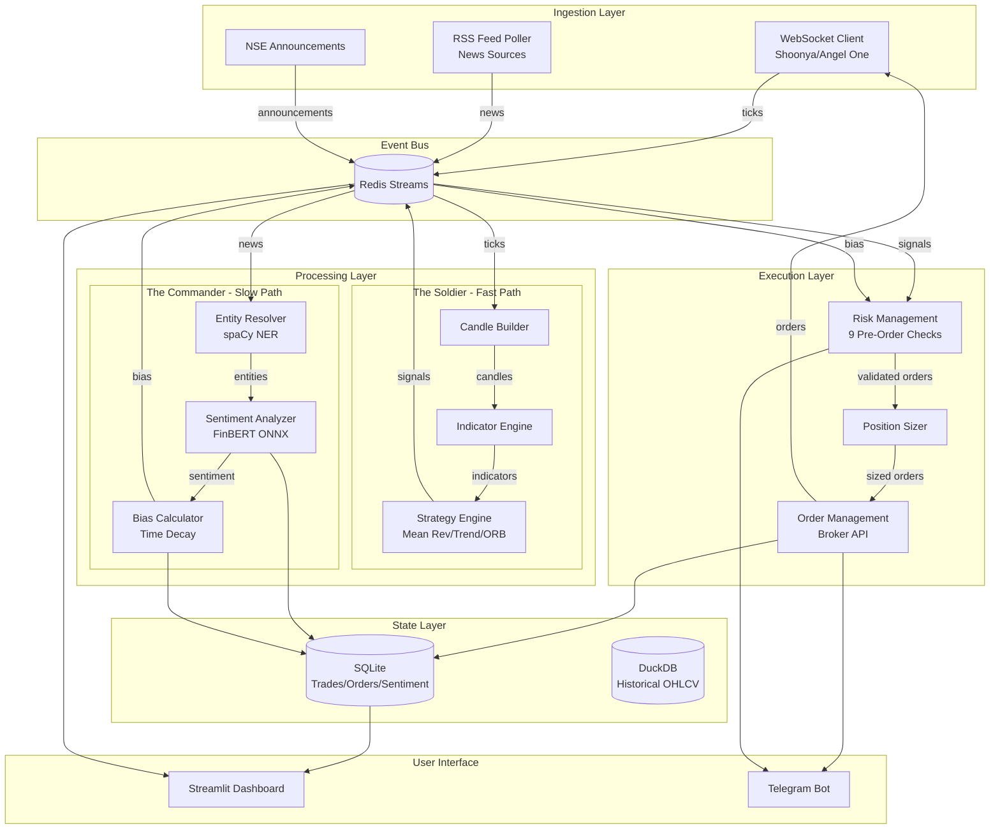

# Design Document: LOHI-TRADE (Unified)

> **Note**: This is the consolidated design document covering the full LOHI-TRADE system. It includes the backend core architecture (below), the FastAPI backend gateway, the React frontend web app, and all frontend enhancements. Frontend and gateway design details are appended at the end of this document.

## Overview

LOHI-TRADE is an event-driven algorithmic trading system that combines technical analysis with AI-powered sentiment analysis for Indian equity markets. The system architecture follows a strict separation of concerns with four primary layers:

1. **Ingestion Layer**: Captures real-time market data and news feeds
2. **Processing Layer**: Dual-engine approach with The Soldier (fast technical analysis) and The Commander (slow AI sentiment analysis)
3. **State Layer**: Event-driven communication via Redis Streams with persistent storage in SQLite/DuckDB
4. **Execution Layer**: Risk management and order execution with comprehensive safety mechanisms

The system is optimized for Apple M3 Pro hardware, utilizing performance cores for latency-sensitive operations and efficiency cores for background processing. The Neural Engine accelerates FinBERT inference for sentiment analysis.

### Key Design Principles

- **Event-Driven Architecture**: All components communicate via Redis Streams, enabling loose coupling and independent scaling
- **Fail-Safe Design**: Multiple layers of risk management with kill switch mechanisms
- **Local-First**: No cloud dependencies, all processing happens on local hardware
- **Testability**: Comprehensive unit and property-based testing with paper trading mode
- **Observability**: Structured logging, real-time dashboard, and Telegram notifications

## Architecture

### High-Level System Diagram



### Component Interaction Flow

**Fast Path (Technical Signal Generation)**:
1. WebSocket receives tick → publishes to `stream:ticks:{symbol}`
2. Candle Builder consumes ticks → builds 1m/5m/15m candles → publishes to `stream:candles:{symbol}:{timeframe}`
3. Indicator Engine consumes candles → calculates indicators → publishes to `stream:indicators:{symbol}`
4. Strategy Engine consumes indicators → generates signals → publishes to `stream:signals`

**Slow Path (Sentiment Analysis)**:
1. RSS Poller fetches news → publishes to `stream:news`
2. Entity Resolver consumes news → extracts tickers → publishes to `stream:entities`
3. Sentiment Analyzer consumes entities → runs FinBERT → publishes to `stream:sentiment`
4. Bias Calculator aggregates sentiment → applies time decay → publishes to `stream:bias:{symbol}`

**Execution Path (Order Processing)**:
1. RMS consumes signals from `stream:signals`
2. RMS fetches current bias from `stream:bias:{symbol}`
3. RMS performs 9 pre-order checks (bias filter, daily loss, position limits, etc.)
4. Position Sizer calculates quantity based on ATR and risk per trade
5. OMS places order via broker API with rate limiting
6. OMS monitors fills and places stop-loss/target orders
7. All events logged to SQLite for audit trail

### Process Allocation (M3 Pro Optimization)

**Performance Cores (P-cores)**: Latency-sensitive operations
- WebSocket tick ingestion
- Candle building
- Indicator calculation
- Signal generation
- Order placement

**Efficiency Cores (E-cores)**: Background processing
- News polling
- Entity resolution
- Bias calculation
- Database writes
- Dashboard updates

**Neural Engine**: ML inference
- FinBERT sentiment analysis (ONNX Runtime with CoreML backend)

## Components and Interfaces

### 1. WebSocket Client (Ingestion Layer)

**Responsibility**: Establish and maintain WebSocket connections to broker APIs, receive real-time ticks, publish to Event Bus.

**Interface**:
```python
class WebSocketClient:
    def connect(broker: BrokerType, credentials: BrokerCredentials) -> None
    def subscribe(symbols: List[str]) -> None
    def on_tick(callback: Callable[[Tick], None]) -> None
    def disconnect() -> None
    def is_connected() -> bool
```

**Key Design Decisions**:
- Support multiple broker implementations (Shoonya primary, Angel One backup) via adapter pattern
- Automatic reconnection with exponential backoff (1s, 2s, 4s, 8s, max 30s)
- Heartbeat monitoring: trigger alert if no ticks for 5 seconds
- Publish ticks to Redis Stream `stream:ticks:{symbol}` with maxlen=1000 (keep last 1000 ticks)

**Data Structures**:
```python
@dataclass
class Tick:
    symbol: str
    token: int
    ltp: float  # Last traded price
    volume: int
    timestamp: datetime
    exchange: str
```

### 2. Candle Builder (The Soldier)

**Responsibility**: Aggregate ticks into OHLCV candles for multiple timeframes.

**Interface**:
```python
class CandleBuilder:
    def __init__(timeframes: List[str])  # ['1m', '5m', '15m']
    def process_tick(tick: Tick) -> None
    def get_current_candle(symbol: str, timeframe: str) -> Optional[Candle]
    def on_candle_complete(callback: Callable[[Candle], None]) -> None
```

**Key Design Decisions**:
- Maintain in-memory state for current candles (reset daily)
- Use time-based bucketing: 1m candles at :00 seconds, 5m at :00/:05/:10, etc.
- Handle market gaps by carrying forward last known price
- Publish completed candles to `stream:candles:{symbol}:{timeframe}`

**Data Structures**:
```python
@dataclass
class Candle:
    symbol: str
    timeframe: str
    open: float
    high: float
    low: float
    close: float
    volume: int
    timestamp: datetime
    is_complete: bool
```

### 3. Indicator Engine (The Soldier)

**Responsibility**: Calculate technical indicators on completed candles.

**Interface**:
```python
class IndicatorEngine:
    def calculate_indicators(candles: pd.DataFrame) -> IndicatorSet
    def get_latest_indicators(symbol: str) -> Optional[IndicatorSet]
```

**Key Design Decisions**:
- Use pandas-ta library for indicator calculations
- Maintain rolling window of last 100 candles per symbol for indicator calculation
- Calculate all indicators in single pass for efficiency
- Publish indicators to `stream:indicators:{symbol}`

**Data Structures**:
```python
@dataclass
class IndicatorSet:
    symbol: str
    timeframe: str
    timestamp: datetime
    rsi_14: float
    macd: float
    macd_signal: float
    macd_hist: float
    bb_upper: float
    bb_middle: float
    bb_lower: float
    vwap: float
    ema_9: float
    ema_21: float
    supertrend: float
    supertrend_direction: int  # 1=bullish, -1=bearish
    atr_14: float
    volume_avg_20: float
```

### 4. Strategy Engine (The Soldier)

**Responsibility**: Generate trading signals based on technical indicators.

**Interface**:
```python
class Strategy(ABC):
    @abstractmethod
    def generate_signal(indicators: IndicatorSet, candles: pd.DataFrame) -> Optional[Signal]
    
class MeanReversionStrategy(Strategy):
    pass
    
class TrendFollowingStrategy(Strategy):
    pass
    
class OpeningRangeBreakoutStrategy(Strategy):
    pass
```

**Key Design Decisions**:
- Each strategy is independent and stateless
- Strategies run in parallel for each symbol
- Signals include entry price, stop loss (ATR-based), and target price
- Publish signals to `stream:signals` for RMS consumption

**Signal Generation Logic**:

*Mean Reversion*:
- Entry: RSI < 30 AND price < BB_lower AND volume > 1.5 × volume_avg AND price > VWAP
- Stop Loss: entry_price - (1.5 × ATR)
- Target: BB_middle

*Trend Following*:
- Entry: EMA_9 crosses above EMA_21 AND MACD > 0 AND MACD rising AND price > VWAP AND supertrend_direction == 1 AND volume > volume_avg
- Stop Loss: entry_price - (2 × ATR)
- Target: entry_price + (3 × ATR)

*Opening Range Breakout*:
- Setup: Calculate opening range (high/low) from 9:15-9:30 AM
- Entry (9:30-10:30 AM): price breaks above/below opening range with volume > 2 × volume_avg
- Stop Loss: opposite end of opening range
- Target: opening_range_size × 1.5

**Data Structures**:
```python
@dataclass
class Signal:
    signal_id: str  # UUID
    symbol: str
    strategy: str
    side: str  # 'BUY' or 'SELL'
    entry_price: float
    stop_loss: float
    target: float
    quantity: int  # Will be calculated by Position Sizer
    timestamp: datetime
    indicators: IndicatorSet  # Snapshot of indicators at signal time
```

### 5. RSS Feed Poller (The Commander)

**Responsibility**: Poll financial news RSS feeds and publish to Event Bus.

**Interface**:
```python
class RSSPoller:
    def __init__(sources: List[RSSSource])
    def start_polling(interval_seconds: int = 60) -> None
    def stop_polling() -> None
```

**Key Design Decisions**:
- Poll MoneyControl, Economic Times, LiveMint every 60 seconds
- Deduplicate using content hash (SHA256 of title + first 200 chars)
- Store hash in Redis Set with 24-hour TTL
- Publish unique articles to `stream:news`

**Data Structures**:
```python
@dataclass
class NewsArticle:
    article_id: str  # UUID
    source: str
    title: str
    content: str
    url: str
    published_at: datetime
    fetched_at: datetime
    content_hash: str
```

### 6. Entity Resolver (The Commander)

**Responsibility**: Extract company names from news and map to NSE tickers.

**Interface**:
```python
class EntityResolver:
    def __init__(ticker_map: Dict[str, str])
    def resolve_entities(article: NewsArticle) -> List[str]  # Returns list of tickers
```

**Key Design Decisions**:
- Use spaCy en_core_web_sm for Named Entity Recognition (ORG entities)
- Maintain ticker mapping dictionary: {"Reliance Industries": "RELIANCE", "TCS": "TCS", ...}
- Support fuzzy matching with threshold 0.85 using rapidfuzz library
- Publish resolved entities to `stream:entities`

**Data Structures**:
```python
@dataclass
class ResolvedEntity:
    article_id: str
    tickers: List[str]
    entities_found: List[str]  # Raw company names extracted
    timestamp: datetime
```

### 7. Sentiment Analyzer (The Commander)

**Responsibility**: Classify news sentiment using FinBERT model.

**Interface**:
```python
class SentimentAnalyzer:
    def __init__(model_path: str)
    def analyze(text: str) -> SentimentResult
    def analyze_batch(texts: List[str]) -> List[SentimentResult]
```

**Key Design Decisions**:
- Use FinBERT model from HuggingFace (ProsusAI/finbert)
- Convert to ONNX format for Apple Neural Engine acceleration
- Use ONNX Runtime with CoreML execution provider
- Apply Indian market keyword boosters after base sentiment:
  - Positive boosters: "SEBI approval" (+0.1), "record profit" (+0.15), "dividend" (+0.08)
  - Negative boosters: "regulatory penalty" (-0.15), "fraud" (-0.2), "downgrade" (-0.12)
- Publish sentiment to `stream:sentiment`

**Data Structures**:
```python
@dataclass
class SentimentResult:
    article_id: str
    ticker: str
    sentiment: str  # 'POSITIVE', 'NEGATIVE', 'NEUTRAL'
    confidence: float  # 0.0 to 1.0
    raw_score: float  # -1.0 to 1.0
    boosted_score: float  # After keyword boosters
    timestamp: datetime
```

### 8. Bias Calculator (The Commander)

**Responsibility**: Aggregate sentiment with time decay to produce trading bias.

**Interface**:
```python
class BiasCalculator:
    def calculate_bias(ticker: str) -> BiasResult
    def get_current_bias(ticker: str) -> Optional[BiasResult]
```

**Key Design Decisions**:
- Aggregate all sentiment from last 24 hours
- Apply exponential time decay: weight = exp(-λ × hours_ago), where λ = ln(2)/4 (half-life 4 hours)
- Weighted average: bias_score = Σ(sentiment_score × weight) / Σ(weight)
- Classification: BULLISH (score > 0.2), BEARISH (score < -0.2), NEUTRAL (otherwise)
- Recalculate every 5 minutes during market hours
- Publish to `stream:bias:{ticker}` and store in SQLite

**Data Structures**:
```python
@dataclass
class BiasResult:
    ticker: str
    bias: str  # 'BULLISH', 'NEUTRAL', 'BEARISH'
    score: float  # -1.0 to 1.0
    confidence: float  # Based on number of articles and score consistency
    article_count: int
    timestamp: datetime
```

### 9. Risk Management System (Execution Layer)

**Responsibility**: Validate all orders against 9 pre-order checks before execution.

**Interface**:
```python
class RiskManagementSystem:
    def validate_order(signal: Signal) -> ValidationResult
    def get_current_exposure() -> ExposureMetrics
    def activate_kill_switch(reason: str) -> None
    def deactivate_kill_switch() -> None
```

**9 Pre-Order Checks**:
1. **Kill Switch Check**: Reject if kill switch is active
2. **Trading Hours Check**: Reject if time < 9:30 AM or > 3:10 PM IST
3. **Daily Loss Limit**: Reject if realized P&L today < -2% of capital
4. **Position Limit**: Reject if open positions >= 5
5. **Position Size Limit**: Reject if order value > 20% of capital
6. **Order Count Limit**: Reject if orders placed today >= 20
7. **Cooldown Check**: Reject if last trade was a loss and < 5 minutes ago
8. **Volatility Guard**: Reject if Nifty dropped > 2% in last 10 minutes
9. **Bias Filter**: Reject BUY if bias is BEARISH, reject SELL if bias is BULLISH

**Key Design Decisions**:
- All checks must pass for order to proceed
- Log rejection reason for each failed check
- Publish rejection events to `stream:rejections` for monitoring
- Auto-activate kill switch on daily loss limit or volatility guard trigger

**Data Structures**:
```python
@dataclass
class ValidationResult:
    is_valid: bool
    rejection_reason: Optional[str]
    checks_passed: List[str]
    checks_failed: List[str]
    timestamp: datetime

@dataclass
class ExposureMetrics:
    total_capital: float
    available_capital: float
    open_positions: int
    daily_pnl: float
    daily_pnl_pct: float
    orders_today: int
    max_position_size: float
```

### 10. Position Sizer (Execution Layer)

**Responsibility**: Calculate order quantity based on risk per trade and ATR.

**Interface**:
```python
class PositionSizer:
    def calculate_quantity(signal: Signal, capital: float, risk_pct: float) -> int
```

**Key Design Decisions**:
- Formula: quantity = (capital × risk_pct) / (entry_price - stop_loss)
- Enforce max position size: min(calculated_qty, max_position_size / entry_price)
- Round to nearest integer (no fractional shares)
- Reject if calculated quantity < 1

**Example Calculation**:
- Capital: ₹2,00,000
- Risk per trade: 1% = ₹2,000
- Entry price: ₹1,000
- Stop loss: ₹980 (ATR-based)
- Risk per share: ₹20
- Quantity: ₹2,000 / ₹20 = 100 shares
- Position value: 100 × ₹1,000 = ₹1,00,000 (50% of capital)
- Max position size: 20% of capital = ₹40,000
- Final quantity: ₹40,000 / ₹1,000 = 40 shares

### 11. Order Management System (Execution Layer)

**Responsibility**: Place orders via broker API, monitor fills, manage stop-loss/target orders.

**Interface**:
```python
class OrderManagementSystem:
    def place_order(order: Order) -> OrderResult
    def cancel_order(order_id: str) -> bool
    def get_order_status(order_id: str) -> OrderStatus
    def monitor_fills() -> None
    def square_off_all_positions() -> None
```

**Key Design Decisions**:
- Use MIS (Margin Intraday Square-off) product type for all orders
- Implement token bucket rate limiter: 8 requests/second (broker limit is 10/s)
- Retry failed orders up to 2 times with 500ms delay
- Poll order status every 1 second for pending orders
- Cancel orders unfilled after 60 seconds
- Place stop-loss and target orders immediately after fill
- Implement trailing stop-loss: move stop up by 50% of profit when price moves favorably
- Force square-off all positions at 3:15 PM

**Data Structures**:
```python
@dataclass
class Order:
    order_id: str  # Internal UUID
    symbol: str
    side: str  # 'BUY' or 'SELL'
    order_type: str  # 'MARKET', 'LIMIT', 'SL', 'SL-M'
    quantity: int
    price: Optional[float]
    trigger_price: Optional[float]
    product_type: str  # 'MIS'
    status: str  # 'PENDING', 'PLACED', 'FILLED', 'REJECTED', 'CANCELLED'
    broker_order_id: Optional[str]
    filled_qty: int
    filled_price: Optional[float]
    timestamp: datetime

@dataclass
class Position:
    position_id: str
    symbol: str
    side: str
    entry_price: float
    quantity: int
    current_price: float
    unrealized_pnl: float
    stop_loss: float
    target: float
    entry_time: datetime
    strategy: str
```

### 12. Kill Switch (Execution Layer)

**Responsibility**: Emergency halt mechanism for all trading activity.

**Interface**:
```python
class KillSwitch:
    def activate(reason: str) -> None
    def deactivate() -> None
    def is_active() -> bool
    def get_activation_reason() -> Optional[str]
```

**Key Design Decisions**:
- Store state in Redis key `killswitch:active` (boolean)
- Store activation reason in Redis key `killswitch:reason`
- Automatic triggers:
  - Daily loss exceeds 2% of capital
  - Nifty drops > 2% in 10 minutes
- Manual triggers:
  - Streamlit dashboard button
  - Telegram command `/killswitch`
- When activated:
  - RMS rejects all new orders immediately
  - OMS cancels all pending orders within 5 seconds
  - Send Telegram notification with reason
- Requires manual deactivation (no auto-reset)

### 13. Streamlit Dashboard (User Interface)

**Responsibility**: Real-time web dashboard for monitoring and control.

**Interface**:
```python
def render_dashboard() -> None
def update_metrics() -> None  # Called every 5 seconds
```

**Key Design Decisions**:
- Single-page application with auto-refresh every 5 seconds
- Components:
  - **Header**: Current time, market status, kill switch button
  - **P&L Card**: Today's realized P&L, unrealized P&L, total P&L
  - **Positions Table**: Open positions with entry price, current price, P&L%
  - **Signals Table**: Recent signals (last 20) with strategy, symbol, side, timestamp
  - **Trades Table**: Recent trades (last 50) with entry/exit prices, realized P&L
  - **Bias Table**: Current bias for all symbols with sentiment scores
  - **System Health**: WebSocket status, Redis status, database status, memory usage
- Use Streamlit components: st.metric, st.dataframe, st.button
- Fetch data from Redis and SQLite

### 14. Telegram Bot (User Interface)

**Responsibility**: Send notifications and accept commands via Telegram.

**Interface**:
```python
class TelegramBot:
    def send_message(text: str) -> None
    def send_trade_notification(trade: Trade) -> None
    def send_daily_summary() -> None
    def handle_command(command: str) -> str
```

**Key Design Decisions**:
- Use python-telegram-bot library
- Supported commands:
  - `/status`: Show open positions and current P&L
  - `/pnl`: Show today's P&L breakdown
  - `/killswitch`: Activate kill switch
  - `/help`: Show available commands
- Notifications:
  - Trade entry: "🟢 BUY RELIANCE @ ₹2,500 | Qty: 40 | Strategy: Trend Following"
  - Trade exit: "🔴 SELL RELIANCE @ ₹2,550 | P&L: +₹2,000 (+2.0%) | Hold: 45m"
  - Kill switch: "🛑 KILL SWITCH ACTIVATED | Reason: Daily loss limit"
  - Daily summary (3:45 PM): "📊 Daily Summary | P&L: +₹5,000 (+2.5%) | Trades: 8 | Win Rate: 62.5%"
- Rate limit: Max 20 messages per hour

## Data Models

### Database Schema (SQLite)

**trades table**:
```sql
CREATE TABLE trades (
    id INTEGER PRIMARY KEY AUTOINCREMENT,
    trade_id TEXT UNIQUE NOT NULL,
    symbol TEXT NOT NULL,
    side TEXT NOT NULL,
    strategy TEXT NOT NULL,
    entry_price REAL NOT NULL,
    exit_price REAL,
    quantity INTEGER NOT NULL,
    entry_time TIMESTAMP NOT NULL,
    exit_time TIMESTAMP,
    realized_pnl REAL,
    stop_loss REAL NOT NULL,
    target REAL NOT NULL,
    exit_reason TEXT,
    created_at TIMESTAMP DEFAULT CURRENT_TIMESTAMP
);
CREATE INDEX idx_trades_symbol ON trades(symbol);
CREATE INDEX idx_trades_entry_time ON trades(entry_time);
```

**orders table**:
```sql
CREATE TABLE orders (
    id INTEGER PRIMARY KEY AUTOINCREMENT,
    order_id TEXT UNIQUE NOT NULL,
    trade_id TEXT,
    symbol TEXT NOT NULL,
    side TEXT NOT NULL,
    order_type TEXT NOT NULL,
    quantity INTEGER NOT NULL,
    price REAL,
    trigger_price REAL,
    status TEXT NOT NULL,
    broker_order_id TEXT,
    filled_qty INTEGER DEFAULT 0,
    filled_price REAL,
    rejection_reason TEXT,
    created_at TIMESTAMP DEFAULT CURRENT_TIMESTAMP,
    updated_at TIMESTAMP DEFAULT CURRENT_TIMESTAMP,
    FOREIGN KEY (trade_id) REFERENCES trades(trade_id)
);
CREATE INDEX idx_orders_status ON orders(status);
CREATE INDEX idx_orders_created_at ON orders(created_at);
```

**sentiment_log table**:
```sql
CREATE TABLE sentiment_log (
    id INTEGER PRIMARY KEY AUTOINCREMENT,
    article_id TEXT NOT NULL,
    ticker TEXT NOT NULL,
    sentiment TEXT NOT NULL,
    confidence REAL NOT NULL,
    raw_score REAL NOT NULL,
    boosted_score REAL NOT NULL,
    news_title TEXT NOT NULL,
    news_source TEXT NOT NULL,
    created_at TIMESTAMP DEFAULT CURRENT_TIMESTAMP
);
CREATE INDEX idx_sentiment_ticker ON sentiment_log(ticker);
CREATE INDEX idx_sentiment_created_at ON sentiment_log(created_at);
```

**bias_log table**:
```sql
CREATE TABLE bias_log (
    id INTEGER PRIMARY KEY AUTOINCREMENT,
    ticker TEXT NOT NULL,
    bias TEXT NOT NULL,
    score REAL NOT NULL,
    confidence REAL NOT NULL,
    article_count INTEGER NOT NULL,
    created_at TIMESTAMP DEFAULT CURRENT_TIMESTAMP
);
CREATE INDEX idx_bias_ticker_time ON bias_log(ticker, created_at);
```

**audit_log table**:
```sql
CREATE TABLE audit_log (
    id INTEGER PRIMARY KEY AUTOINCREMENT,
    event_type TEXT NOT NULL,
    component TEXT NOT NULL,
    message TEXT NOT NULL,
    metadata TEXT,
    created_at TIMESTAMP DEFAULT CURRENT_TIMESTAMP
);
CREATE INDEX idx_audit_event_type ON audit_log(event_type);
CREATE INDEX idx_audit_created_at ON audit_log(created_at);
```

### Redis Streams Schema

**Stream: stream:ticks:{symbol}**
- Fields: symbol, token, ltp, volume, timestamp, exchange
- Maxlen: 1000 (circular buffer)
- Consumer: CandleBuilder

**Stream: stream:candles:{symbol}:{timeframe}**
- Fields: symbol, timeframe, open, high, low, close, volume, timestamp
- Maxlen: 500
- Consumer: IndicatorEngine

**Stream: stream:indicators:{symbol}**
- Fields: symbol, timeframe, timestamp, rsi_14, macd, macd_signal, bb_upper, bb_lower, vwap, ema_9, ema_21, supertrend, atr_14, volume_avg_20
- Maxlen: 100
- Consumer: StrategyEngine

**Stream: stream:signals**
- Fields: signal_id, symbol, strategy, side, entry_price, stop_loss, target, timestamp, indicators_json
- Maxlen: 1000
- Consumer: RMS

**Stream: stream:news**
- Fields: article_id, source, title, content, url, published_at, fetched_at, content_hash
- Maxlen: 5000
- Consumer: EntityResolver

**Stream: stream:entities**
- Fields: article_id, tickers_json, entities_found_json, timestamp
- Maxlen: 5000
- Consumer: SentimentAnalyzer

**Stream: stream:sentiment**
- Fields: article_id, ticker, sentiment, confidence, raw_score, boosted_score, timestamp
- Maxlen: 10000
- Consumer: BiasCalculator

**Stream: stream:bias:{ticker}**
- Fields: ticker, bias, score, confidence, article_count, timestamp
- Maxlen: 100
- Consumer: RMS

### Configuration Schema (settings.yaml)

```yaml
capital:
  total: 200000
  risk_per_trade_pct: 1.0
  max_position_size_pct: 20.0
  max_daily_loss_pct: 2.0

risk_limits:
  max_open_positions: 5
  max_orders_per_day: 20
  cooldown_after_loss_minutes: 5
  volatility_guard_threshold_pct: 2.0
  volatility_guard_window_minutes: 10

trading_hours:
  market_open: "09:15"
  trading_start: "09:30"
  trading_end: "15:10"
  square_off_time: "15:15"
  market_close: "15:30"

broker:
  primary: "shoonya"
  backup: "angelone"
  shoonya:
    api_key: "${SHOONYA_API_KEY}"
    client_id: "${SHOONYA_CLIENT_ID}"
    password: "${SHOONYA_PASSWORD}"
  angelone:
    api_key: "${ANGELONE_API_KEY}"
    client_id: "${ANGELONE_CLIENT_ID}"
    password: "${ANGELONE_PASSWORD}"

strategies:
  mean_reversion:
    enabled: true
    rsi_oversold: 30
    rsi_overbought: 65
    volume_multiplier: 1.5
    stop_loss_atr_multiplier: 1.5
  
  trend_following:
    enabled: true
    ema_fast: 9
    ema_slow: 21
    stop_loss_atr_multiplier: 2.0
    target_atr_multiplier: 3.0
  
  opening_range_breakout:
    enabled: true
    range_start: "09:15"
    range_end: "09:30"
    trade_window_start: "09:30"
    trade_window_end: "10:30"
    volume_multiplier: 2.0
    target_pct: 0.5
    stop_loss_pct: 0.3

sentiment:
  bias_bullish_threshold: 0.2
  bias_bearish_threshold: -0.2
  time_decay_half_life_hours: 4.0
  lookback_hours: 24
  recalculation_interval_minutes: 5

telegram:
  bot_token: "${TELEGRAM_BOT_TOKEN}"
  chat_id: "${TELEGRAM_CHAT_ID}"
  rate_limit_messages_per_hour: 20

redis:
  host: "localhost"
  port: 6379
  db: 0

database:
  sqlite_path: "data/lohi_trade.db"
  duckdb_path: "data/historical.duckdb"
  backup_path: "data/backups"
  backup_time: "16:00"

logging:
  level: "INFO"
  log_dir: "data/logs"
  max_file_size_mb: 100
  backup_count: 10

paper_trading:
  enabled: false
  simulated_fill_delay_ms: [100, 500]
  simulated_slippage_pct: 0.05

symbols:
  - "RELIANCE"
  - "TCS"
  - "HDFCBANK"
  - "INFY"
  - "ICICIBANK"
  # ... (Nifty 50 constituents)
```

## Correctness Properties

*A property is a characteristic or behavior that should hold true across all valid executions of a system—essentially, a formal statement about what the system should do. Properties serve as the bridge between human-readable specifications and machine-verifiable correctness guarantees.*

### Property Reflection

After analyzing all acceptance criteria, I identified the following categories:
- **Properties (universal rules)**: 80+ testable properties covering data processing, risk management, and system behavior
- **Examples (specific cases)**: ~15 specific scenarios like startup timing, polling intervals, and time-based triggers
- **Edge cases**: Handled within properties through generator configuration
- **Not testable**: ~40 criteria covering implementation details, UI rendering, and infrastructure

**Redundancy Analysis**:
- Position sizing properties (10.1-10.7) can be consolidated into comprehensive position sizing tests
- RMS rejection properties (9.2-9.9) can be tested together as a suite of risk checks
- Persistence properties across components can share common testing patterns
- Latency properties can be grouped by component for performance testing

The properties below focus on unique validation value, avoiding redundancy while ensuring comprehensive coverage.

### Core Data Processing Properties

**Property 1: Tick to Event Bus Latency**
*For any* tick received from the broker WebSocket, the time from receipt to Event_Bus publish should be less than 10 milliseconds.
**Validates: Requirements 1.2**

**Property 2: WebSocket Reconnection Backoff**
*For any* WebSocket connection failure, reconnection attempts should follow exponential backoff pattern (1s, 2s, 4s, 8s, max 30s).
**Validates: Requirements 1.3**

**Property 3: Broker Switch Data Continuity**
*For any* broker API switch during operation, no duplicate ticks should appear in the Event_Bus and no ticks should be lost.
**Validates: Requirements 1.6**

**Property 4: Tick Processing Throughput**
*For any* sequence of 1000+ ticks per second, all ticks should be processed and published to Event_Bus without data loss.
**Validates: Requirements 1.7**

**Property 5: Multi-Timeframe Candle Building**
*For any* sequence of ticks, candles should be built and published for all configured timeframes (1m, 5m, 15m).
**Validates: Requirements 2.1**

**Property 6: OHLCV Calculation Correctness**
*For any* sequence of ticks within a candle period, the calculated Open should equal the first tick price, High should equal the maximum tick price, Low should equal the minimum tick price, Close should equal the last tick price, and Volume should equal the sum of all tick volumes.
**Validates: Requirements 2.3**

**Property 7: Market Gap Handling**
*For any* candle period with no ticks received, the candle should use the last known price from the previous period for all OHLCV values.
**Validates: Requirements 2.4**

**Property 8: Indicator Calculation Completeness**
*For any* completed candle with sufficient historical data (100+ prior candles), all configured indicators (RSI, MACD, Bollinger Bands, VWAP, EMA, Supertrend, ATR) should be calculated and published.
**Validates: Requirements 3.1**

**Property 9: Indicator Calculation with Insufficient Data**
*For any* symbol with fewer candles than the maximum indicator period required, no indicators should be calculated or published.
**Validates: Requirements 3.3**

**Property 10: Symbol Isolation in Indicator Calculation**
*For any* two different symbols, indicator calculations for one symbol should not affect indicator values for the other symbol.
**Validates: Requirements 3.4**

### Signal Generation Properties

**Property 11: Mean Reversion Signal Conditions**
*For any* indicator set where RSI < 30 AND price < BB_lower AND volume > 1.5 × volume_avg AND price > VWAP, a BUY signal should be generated with entry price, stop loss, and target.
**Validates: Requirements 4.2**

**Property 12: Trend Following Signal Conditions**
*For any* indicator set where EMA_9 crosses above EMA_21 AND MACD > 0 AND MACD rising AND price > VWAP AND supertrend_direction == 1 AND volume > volume_avg, a BUY signal should be generated.
**Validates: Requirements 4.3**

**Property 13: Opening Range Breakout Signal Conditions**
*For any* price movement that breaks above or below the opening range (9:15-9:30 AM) with volume > 2 × volume_avg during the trade window (9:30-10:30 AM), a BUY or SELL signal should be generated.
**Validates: Requirements 4.4**

**Property 14: Signal Completeness**
*For any* generated signal, it must include all required fields: signal_id, symbol, strategy, side, entry_price, stop_loss, target, and timestamp.
**Validates: Requirements 4.5**

**Property 15: Trading Hours Signal Filter**
*For any* time outside trading hours (before 9:30 AM or after 3:10 PM IST), no signals should be generated regardless of indicator conditions.
**Validates: Requirements 4.7**

**Property 16: Duplicate Position Prevention**
*For any* symbol with an existing open position or pending order, no new signal should be generated for that symbol.
**Validates: Requirements 4.8**

### News and Sentiment Properties

**Property 17: News Article Completeness**
*For any* fetched news article, all required fields (title, content, timestamp, source, url) should be extracted and present.
**Validates: Requirements 5.3**

**Property 18: News Deduplication**
*For any* two news articles with identical content hash, only one should be stored and published to the Event_Bus.
**Validates: Requirements 5.4, 5.5**

**Property 19: Entity Resolution Mapping**
*For any* company name in the ticker mapping dictionary, it should be correctly mapped to its corresponding NSE ticker symbol.
**Validates: Requirements 6.2**

**Property 20: Multi-Entity Article Association**
*For any* news article containing N company names (N ≥ 1), the article should be associated with all N corresponding ticker symbols.
**Validates: Requirements 6.3**

**Property 21: Unmapped Entity Handling**
*For any* company name not found in the ticker mapping dictionary, it should be logged as unmapped and sentiment processing should be skipped for that entity.
**Validates: Requirements 6.4**

**Property 22: Sentiment Classification**
*For any* news text analyzed by FinBERT, the result should be classified as exactly one of POSITIVE, NEGATIVE, or NEUTRAL with a confidence score between 0.0 and 1.0.
**Validates: Requirements 7.3**

**Property 23: Keyword Boosting**
*For any* news text containing Indian market keywords (e.g., "SEBI approval", "regulatory penalty"), the sentiment score should be adjusted by the configured boost value.
**Validates: Requirements 7.5**

**Property 24: Sentiment Error Handling**
*For any* FinBERT inference failure, the sentiment should default to NEUTRAL and the error should be logged.
**Validates: Requirements 7.7**

**Property 25: Bias Time Decay**
*For any* sentiment score at time T, its weight in bias calculation at time T + 4 hours should be 0.5 times the original weight (exponential decay with 4-hour half-life).
**Validates: Requirements 8.2**

**Property 26: Bias Classification Thresholds**
*For any* aggregated bias score, it should be classified as BULLISH if score > 0.2, BEARISH if score < -0.2, and NEUTRAL if -0.2 ≤ score ≤ 0.2.
**Validates: Requirements 8.3**

### Risk Management Properties

**Property 27: RMS Pre-Order Check Execution**
*For any* order submitted to RMS, all 9 pre-order checks (kill switch, trading hours, daily loss, position limit, position size, order count, cooldown, volatility guard, bias filter) should be performed before forwarding to OMS.
**Validates: Requirements 9.1**

**Property 28: Daily Loss Limit Enforcement**
*For any* order when realized daily P&L is less than -2% of total capital, the order should be rejected with reason "Daily loss limit exceeded".
**Validates: Requirements 9.2**

**Property 29: Position Count Limit Enforcement**
*For any* order when the count of open positions is greater than or equal to 5, the order should be rejected with reason "Position limit reached".
**Validates: Requirements 9.3**

**Property 30: Position Size Limit Enforcement**
*For any* order where order value exceeds 20% of total capital, the order should be rejected with reason "Position size limit exceeded".
**Validates: Requirements 9.4**

**Property 31: Order Count Limit Enforcement**
*For any* order when the count of orders placed today is greater than or equal to 20, the order should be rejected with reason "Order count limit reached".
**Validates: Requirements 9.5**

**Property 32: Cooldown Period Enforcement**
*For any* order when the last trade was a loss and occurred less than 5 minutes ago, the order should be rejected with reason "Cooldown period active".
**Validates: Requirements 9.6**

**Property 33: Kill Switch Enforcement**
*For any* order when the kill switch is activated, the order should be rejected with reason "Kill switch active".
**Validates: Requirements 9.7**

**Property 34: Volatility Guard Enforcement**
*For any* order when Nifty index has dropped more than 2% in the last 10 minutes, the order should be rejected with reason "Volatility guard triggered".
**Validates: Requirements 9.8**

**Property 35: Trading Hours Enforcement**
*For any* order submitted before 9:30 AM IST or after 3:10 PM IST, the order should be rejected with reason "Outside trading hours".
**Validates: Requirements 9.9**

**Property 36: Bias Filter for BUY Signals**
*For any* BUY signal when the current bias for that ticker is BEARISH, the order should be rejected with reason "Bias filter: bearish sentiment".
**Validates: Requirements 9.9 (bias filter check)**

**Property 37: Order Validation Latency**
*For any* order that passes all RMS checks, it should be forwarded to OMS within 50 milliseconds.
**Validates: Requirements 9.10**

**Property 38: Rejection Logging**
*For any* order rejected by RMS, the rejection reason should be published to the Event_Bus and logged to SQLite.
**Validates: Requirements 9.11**

### Position Sizing Properties

**Property 39: Position Size Calculation Formula**
*For any* order with entry_price, stop_loss, capital, and risk_per_trade_pct, the calculated quantity should equal (capital × risk_per_trade_pct / 100) / (entry_price - stop_loss).
**Validates: Requirements 10.1**

**Property 40: Maximum Risk Per Trade**
*For any* calculated position, the actual risk (quantity × (entry_price - stop_loss)) should not exceed 1% of total capital.
**Validates: Requirements 10.2**

**Property 41: Maximum Position Size**
*For any* calculated position, the position value (quantity × entry_price) should not exceed 20% of total capital.
**Validates: Requirements 10.3**

**Property 42: Quantity Capping**
*For any* calculated quantity that would result in position value > 20% of capital, the quantity should be reduced to (0.20 × capital) / entry_price.
**Validates: Requirements 10.4**

**Property 43: Quantity Rounding**
*For any* calculated quantity, the final quantity should be rounded to the nearest integer (no fractional shares).
**Validates: Requirements 10.5**

**Property 44: Minimum Quantity Rejection**
*For any* position size calculation resulting in quantity < 1, the order should be rejected with reason "Insufficient capital for minimum quantity".
**Validates: Requirements 10.7**

### Order Execution Properties

**Property 45: Order Placement Latency**
*For any* order received from RMS, it should be placed via broker API within 100 milliseconds.
**Validates: Requirements 11.1**

**Property 46: MIS Product Type**
*For any* order placed by OMS, the product type should be set to "MIS" (Margin Intraday Square-off).
**Validates: Requirements 11.2**

**Property 47: Rate Limiting**
*For any* sequence of broker API requests, the rate should not exceed 8 requests per second.
**Validates: Requirements 11.3**

**Property 48: Order Persistence**
*For any* order placed via broker API, the order details should be stored in SQLite with all required fields (order_id, symbol, side, quantity, price, status, timestamp).
**Validates: Requirements 11.4**

**Property 49: Broker Rejection Retry**
*For any* order rejected by the broker API, up to 2 retry attempts should be made with 500ms delay between attempts.
**Validates: Requirements 11.5**

**Property 50: Fill Event Handling**
*For any* order that is filled, the order status should be updated to "FILLED" in SQLite and a fill event should be published to the Event_Bus.
**Validates: Requirements 11.6**

**Property 51: Order Timeout Cancellation**
*For any* order that remains in "PENDING" status for more than 60 seconds, the order should be cancelled and status updated to "CANCELLED".
**Validates: Requirements 11.8**

**Property 52: Stop-Loss Placement**
*For any* filled position, a stop-loss order should be placed immediately at the stop_loss price from the original signal.
**Validates: Requirements 12.1**

**Property 53: Target Order Placement**
*For any* filled position, a target limit order should be placed immediately at the target price from the original signal.
**Validates: Requirements 12.2**

**Property 54: Trailing Stop-Loss**
*For any* position where current_price > entry_price, the stop_loss should be updated to entry_price + (0.5 × (current_price - entry_price)).
**Validates: Requirements 12.3**

**Property 55: Position Closing on Stop/Target Hit**
*For any* position where stop-loss or target order is executed, the position status should be updated to "CLOSED" and realized P&L should be calculated as (exit_price - entry_price) × quantity.
**Validates: Requirements 12.4**

**Property 56: OCO Order Cancellation**
*For any* position where either stop-loss or target order is executed, the remaining order (target or stop-loss) should be cancelled immediately.
**Validates: Requirements 12.5**

### Kill Switch Properties

**Property 57: Kill Switch Order Cancellation**
*For any* kill switch activation, all pending orders should be cancelled within 5 seconds.
**Validates: Requirements 13.3**

**Property 58: Automatic Kill Switch on Volatility**
*For any* Nifty index drop exceeding 2% in a 10-minute window, the kill switch should be automatically activated.
**Validates: Requirements 13.6**

**Property 59: Automatic Kill Switch on Daily Loss**
*For any* daily realized P&L falling below -2% of total capital, the kill switch should be automatically activated.
**Validates: Requirements 13.7**

**Property 60: Kill Switch Notification**
*For any* kill switch activation, a Telegram notification should be sent immediately with the activation reason.
**Validates: Requirements 13.8**

**Property 61: Kill Switch Manual Deactivation**
*For any* kill switch activation, the kill switch should remain active until manually deactivated (no automatic reset).
**Validates: Requirements 13.9**

### Backtesting Properties

**Property 62: Transaction Cost Application**
*For any* backtest trade, transaction costs (STT 0.025%, exchange charges 0.00345%, GST, stamp duty) should be applied to the trade P&L.
**Validates: Requirements 15.3**

**Property 63: Slippage Application**
*For any* backtest order, 0.05% slippage should be applied to the execution price.
**Validates: Requirements 15.4**

**Property 64: Backtest Metrics Calculation**
*For any* completed backtest, all metrics (Sharpe Ratio, Max Drawdown, Win Rate, Profit Factor, Total Return) should be calculated and included in the results.
**Validates: Requirements 15.5**

### Paper Trading Properties

**Property 65: Paper Mode API Bypass**
*For any* order in paper trading mode, no actual broker API call should be made (verified by checking API call logs).
**Validates: Requirements 16.2**

**Property 66: Paper Fill Simulation**
*For any* paper order, the fill price should be set to the next available tick price after order placement.
**Validates: Requirements 16.3**

**Property 67: Paper Fill Delay**
*For any* paper order, the fill should occur with a random delay between 100ms and 500ms.
**Validates: Requirements 16.4**

**Property 68: Paper Trade Logging**
*For any* trade in paper trading mode, the log entry should include the prefix "PAPER" in the trade description.
**Validates: Requirements 16.6**

### System Properties

**Property 69: Telegram Trade Notifications**
*For any* trade entry or exit, a Telegram notification should be sent with symbol, side, quantity, price, and P&L (for exits).
**Validates: Requirements 18.1, 18.2**

**Property 70: Structured Logging Format**
*For any* log entry, it should include timestamp, component name, log level, and message in structured format.
**Validates: Requirements 20.2**

**Property 71: Order Logging**
*For any* order (placed, filled, rejected, cancelled), a log entry should be created with full order details.
**Validates: Requirements 20.3**

**Property 72: Trade Persistence**
*For any* completed trade, it should be stored in SQLite trades table with all required fields (trade_id, symbol, side, entry_price, exit_price, quantity, entry_time, exit_time, realized_pnl, strategy).
**Validates: Requirements 22.1 (trades table)**

**Property 73: Sentiment Persistence**
*For any* sentiment analysis result, it should be stored in SQLite sentiment_log table with ticker, sentiment, confidence, raw_score, boosted_score, and timestamp.
**Validates: Requirements 22.1 (sentiment_log table)**

**Property 74: Bias Persistence**
*For any* bias calculation, it should be stored in SQLite bias_log table with ticker, bias, score, confidence, article_count, and timestamp.
**Validates: Requirements 22.1 (bias_log table)**

**Property 75: Historical Data Storage**
*For any* downloaded historical OHLCV data, it should be stored in DuckDB in Parquet format.
**Validates: Requirements 14.3**

**Property 76: Historical Data Backfill**
*For any* missing date range in historical data, the system should download and store the missing data when requested.
**Validates: Requirements 14.5**

**Property 77: Instrument Master Validation**
*For any* configured symbol in settings.yaml, it should exist in the downloaded instrument master file, otherwise a warning should be logged.
**Validates: Requirements 23.4**

**Property 78: Error Logging with Stack Trace**
*For any* component error, the error should be logged with full stack trace and component name.
**Validates: Requirements 25.1**

**Property 79: WebSocket Reconnection on Failure**
*For any* WebSocket connection failure, reconnection should be attempted without crashing other components.
**Validates: Requirements 25.2**

**Property 80: Database Write Retry**
*For any* database write failure, up to 3 retry attempts should be made with exponential backoff (1s, 2s, 4s).
**Validates: Requirements 25.4**

## Error Handling

### Error Categories and Strategies

**1. Network Errors (WebSocket, Broker API)**
- **Strategy**: Automatic retry with exponential backoff
- **Implementation**: 
  - WebSocket: Reconnect with backoff (1s, 2s, 4s, 8s, max 30s)
  - Broker API: Circuit breaker pattern (open after 5 consecutive failures)
  - Heartbeat monitoring: Alert if no ticks for 5 seconds
- **Fallback**: Switch to backup broker (Angel One) if primary (Shoonya) fails repeatedly
- **User Notification**: Telegram alert on connection loss

**2. Data Processing Errors (Candle Building, Indicators)**
- **Strategy**: Log and continue processing other symbols
- **Implementation**:
  - Catch exceptions at symbol level, don't crash entire component
  - Use default values for missing indicators (e.g., NaN)
  - Skip signal generation if indicators are incomplete
- **Monitoring**: Track error rate per symbol, alert if > 10% of symbols failing

**3. Sentiment Analysis Errors (FinBERT, Entity Resolution)**
- **Strategy**: Default to NEUTRAL sentiment and continue
- **Implementation**:
  - Catch inference failures, log error with article details
  - Default sentiment: NEUTRAL with confidence 0.0
  - Skip unmapped entities, log for manual review
- **Monitoring**: Track unmapped entity rate, update ticker mapping periodically

**4. Risk Management Errors (Validation Failures)**
- **Strategy**: Reject order and log detailed reason
- **Implementation**:
  - Each RMS check returns ValidationResult with pass/fail and reason
  - Aggregate all check results before final decision
  - Publish rejection events to Event_Bus for monitoring
- **User Notification**: Telegram notification for repeated rejections (> 5 in 10 minutes)

**5. Order Execution Errors (Broker Rejection, Timeout)**
- **Strategy**: Retry with backoff, then cancel and notify
- **Implementation**:
  - Retry rejected orders up to 2 times with 500ms delay
  - Cancel orders unfilled after 60 seconds
  - Log all broker error codes for analysis
- **User Notification**: Telegram alert for order rejections
- **Fallback**: Activate kill switch if > 3 consecutive order failures

**6. Database Errors (SQLite, DuckDB)**
- **Strategy**: Retry with exponential backoff, then alert
- **Implementation**:
  - Retry writes up to 3 times (1s, 2s, 4s backoff)
  - Use WAL mode for SQLite to reduce lock contention
  - Maintain in-memory buffer for critical data (positions, orders)
- **Monitoring**: Alert if database write failure rate > 1%
- **Recovery**: Daily backup at 4:00 PM, restore from backup if corruption detected

**7. Redis Errors (Event Bus Unavailable)**
- **Strategy**: Reconnect and buffer events in memory
- **Implementation**:
  - Attempt Redis reconnection every 5 seconds
  - Buffer up to 10,000 events in memory during outage
  - Publish buffered events on reconnection
- **Fallback**: If Redis unavailable for > 60 seconds, activate kill switch and shutdown

**8. Kill Switch Triggers (Automatic Activation)**
- **Strategy**: Immediate halt of all trading activity
- **Implementation**:
  - Cancel all pending orders within 5 seconds
  - Reject all new orders immediately
  - Send Telegram notification with reason
  - Log kill switch activation to audit_log
- **Recovery**: Manual deactivation required after reviewing logs

### Error Logging Standards

All errors must be logged with:
- Timestamp (ISO 8601 format with timezone)
- Component name (e.g., "WebSocketClient", "RMS", "OMS")
- Error level (ERROR, WARNING, INFO)
- Error message (human-readable description)
- Stack trace (for exceptions)
- Context (symbol, order_id, signal_id, etc.)
- Correlation ID (for tracing errors across components)

Example log entry:
```json
{
  "timestamp": "2024-01-15T10:30:45.123+05:30",
  "component": "OMS",
  "level": "ERROR",
  "message": "Broker API rejected order",
  "error_code": "INSUFFICIENT_MARGIN",
  "order_id": "550e8400-e29b-41d4-a716-446655440000",
  "symbol": "RELIANCE",
  "correlation_id": "abc123",
  "stack_trace": "..."
}
```

## Testing Strategy

### Dual Testing Approach

The system requires both unit tests and property-based tests for comprehensive coverage:

**Unit Tests**: Verify specific examples, edge cases, and error conditions
- Focus on integration points between components
- Test specific scenarios (e.g., market open at 9:15 AM, forced square-off at 3:15 PM)
- Test error handling paths (e.g., broker rejection, database failure)
- Mock external dependencies (broker API, Redis, SQLite)

**Property-Based Tests**: Verify universal properties across all inputs
- Use hypothesis library for Python property-based testing
- Generate random inputs (ticks, candles, signals, orders) and verify properties hold
- Minimum 100 iterations per property test (due to randomization)
- Each property test must reference its design document property
- Tag format: **Feature: lohi-trade, Property {number}: {property_text}**

### Testing Layers

**1. Component Unit Tests**

*Candle Builder*:
- Test OHLCV calculation with known tick sequences
- Test multi-timeframe candle building (1m, 5m, 15m)
- Test market gap handling (no ticks for extended period)
- Test candle completion and Event_Bus publishing

*Indicator Engine*:
- Test indicator calculation with known candle data
- Test handling of insufficient historical data
- Test symbol isolation (indicators for symbol A don't affect symbol B)
- Test indicator publishing to Event_Bus

*Strategy Engine*:
- Test Mean Reversion signal generation with known indicators
- Test Trend Following signal generation with known indicators
- Test Opening Range Breakout signal generation
- Test signal completeness (all required fields present)
- Test trading hours filter (no signals outside 9:30 AM - 3:10 PM)

*Risk Management System*:
- Test each of the 9 pre-order checks independently
- Test daily loss limit enforcement
- Test position limit enforcement
- Test bias filter (reject BUY when bias is BEARISH)
- Test kill switch enforcement

*Position Sizer*:
- Test position size calculation formula
- Test maximum risk per trade enforcement (1% of capital)
- Test maximum position size enforcement (20% of capital)
- Test quantity rounding and minimum quantity rejection

*Order Management System*:
- Test order placement via mock broker API
- Test rate limiting (8 requests/second)
- Test order retry logic on broker rejection
- Test order timeout cancellation (60 seconds)
- Test stop-loss and target order placement
- Test trailing stop-loss logic
- Test forced square-off at 3:15 PM

*Sentiment Analyzer*:
- Test FinBERT sentiment classification with known news text
- Test keyword boosting (Indian market keywords)
- Test error handling (default to NEUTRAL on failure)

*Bias Calculator*:
- Test time decay calculation (half-life 4 hours)
- Test bias classification (BULLISH > 0.2, BEARISH < -0.2, NEUTRAL otherwise)
- Test aggregation of multiple sentiment scores

**2. Property-Based Tests**

Each correctness property from the design document should have a corresponding property-based test. Examples:

*Property 6: OHLCV Calculation Correctness*:
```python
@given(st.lists(st.floats(min_value=100, max_value=10000), min_size=10, max_size=1000))
def test_ohlcv_calculation(prices):
    """
    Feature: lohi-trade, Property 6: OHLCV Calculation Correctness
    For any sequence of ticks, OHLCV should be correctly calculated.
    """
    ticks = [Tick(symbol="TEST", ltp=p, volume=100, timestamp=datetime.now()) 
             for p in prices]
    candle = build_candle(ticks)
    
    assert candle.open == prices[0]
    assert candle.high == max(prices)
    assert candle.low == min(prices)
    assert candle.close == prices[-1]
    assert candle.volume == 100 * len(prices)
```

*Property 39: Position Size Calculation Formula*:
```python
@given(
    capital=st.floats(min_value=100000, max_value=1000000),
    risk_pct=st.floats(min_value=0.5, max_value=2.0),
    entry_price=st.floats(min_value=100, max_value=10000),
    stop_loss=st.floats(min_value=90, max_value=9900)
)
def test_position_size_calculation(capital, risk_pct, entry_price, stop_loss):
    """
    Feature: lohi-trade, Property 39: Position Size Calculation Formula
    For any order, quantity should equal (capital × risk_pct) / (entry_price - stop_loss).
    """
    assume(entry_price > stop_loss)  # Valid stop loss
    
    signal = Signal(entry_price=entry_price, stop_loss=stop_loss, ...)
    quantity = calculate_position_size(signal, capital, risk_pct)
    
    expected_quantity = int((capital * risk_pct / 100) / (entry_price - stop_loss))
    assert quantity == expected_quantity
```

*Property 28: Daily Loss Limit Enforcement*:
```python
@given(
    capital=st.floats(min_value=100000, max_value=1000000),
    daily_pnl=st.floats(min_value=-10000, max_value=10000)
)
def test_daily_loss_limit(capital, daily_pnl):
    """
    Feature: lohi-trade, Property 28: Daily Loss Limit Enforcement
    For any order when daily P&L < -2% of capital, order should be rejected.
    """
    rms = RiskManagementSystem(capital=capital)
    rms.set_daily_pnl(daily_pnl)
    
    signal = create_test_signal()
    result = rms.validate_order(signal)
    
    if daily_pnl < -0.02 * capital:
        assert not result.is_valid
        assert "Daily loss limit exceeded" in result.rejection_reason
    else:
        # Other checks may still reject, but not daily loss check
        assert "Daily loss limit exceeded" not in result.rejection_reason
```

**3. Integration Tests**

Test end-to-end flows through multiple components:

*Tick to Signal Flow*:
1. Publish ticks to Redis Stream
2. Verify candles are built and published
3. Verify indicators are calculated and published
4. Verify signals are generated and published
5. Verify signals reach RMS for validation

*Signal to Order Flow*:
1. Generate signal from strategy
2. Verify RMS performs all 9 checks
3. Verify Position Sizer calculates quantity
4. Verify OMS places order via broker API
5. Verify order is stored in SQLite

*News to Bias Flow*:
1. Publish news article to Redis Stream
2. Verify entity resolution extracts tickers
3. Verify sentiment analysis classifies sentiment
4. Verify bias calculator aggregates sentiment
5. Verify bias is published and stored

**4. Performance Tests**

Validate system meets latency and throughput requirements:

*Tick Processing Latency*:
- Generate 10,000 ticks
- Measure time from tick receipt to Event_Bus publish
- Assert 99th percentile latency < 10ms

*Throughput Test*:
- Generate 1,000 ticks per second for 60 seconds
- Verify all 60,000 ticks are processed without data loss
- Verify no memory leaks (RSS memory stable)

*Indicator Calculation Latency*:
- Generate 100 candles with full history
- Measure time to calculate all indicators
- Assert latency < 50ms per symbol

**5. Paper Trading Tests**

Run system in paper trading mode for 10 trading days:
- Verify no real broker API calls are made
- Verify paper fills use next tick price
- Verify paper trades are logged with "PAPER" prefix
- Verify all RMS checks are enforced
- Verify kill switch works in paper mode
- Verify daily P&L calculations are correct

**6. Backtesting Validation**

Validate backtesting engine produces realistic results:
- Run backtest on known historical data (2022-2023)
- Verify transaction costs are applied correctly
- Verify slippage is applied (0.05%)
- Verify metrics calculation (Sharpe, Max DD, Win Rate)
- Compare backtest results with manual calculation for sample trades

### Test Configuration

**Property-Based Test Configuration**:
- Library: hypothesis (Python)
- Minimum iterations: 100 per property test
- Seed: Fixed seed for reproducibility in CI/CD
- Shrinking: Enabled to find minimal failing examples
- Deadline: 5 seconds per test case (for performance properties)

**Unit Test Configuration**:
- Framework: pytest
- Coverage target: 80% for core trading logic
- Mocking: pytest-mock for external dependencies
- Fixtures: Shared fixtures for common test data (ticks, candles, signals)

**Integration Test Configuration**:
- Use Docker Compose to spin up Redis for integration tests
- Use in-memory SQLite for database tests
- Mock broker API with realistic responses and delays
- Test timeout: 30 seconds per integration test

**CI/CD Pipeline**:
1. Run unit tests (fast feedback)
2. Run property-based tests (comprehensive coverage)
3. Run integration tests (end-to-end validation)
4. Generate coverage report (enforce 80% minimum)
5. Run performance tests (validate latency requirements)
6. Run backtesting validation (ensure realistic results)

### Test Data Generators

**Tick Generator**:
```python
@st.composite
def tick_generator(draw):
    return Tick(
        symbol=draw(st.sampled_from(["RELIANCE", "TCS", "INFY"])),
        token=draw(st.integers(min_value=1000, max_value=9999)),
        ltp=draw(st.floats(min_value=100, max_value=10000)),
        volume=draw(st.integers(min_value=1, max_value=100000)),
        timestamp=draw(st.datetimes(min_value=datetime(2024, 1, 1))),
        exchange="NSE"
    )
```

**Candle Generator**:
```python
@st.composite
def candle_generator(draw):
    open_price = draw(st.floats(min_value=100, max_value=10000))
    high = draw(st.floats(min_value=open_price, max_value=open_price * 1.1))
    low = draw(st.floats(min_value=open_price * 0.9, max_value=open_price))
    close = draw(st.floats(min_value=low, max_value=high))
    
    return Candle(
        symbol=draw(st.sampled_from(["RELIANCE", "TCS", "INFY"])),
        timeframe=draw(st.sampled_from(["1m", "5m", "15m"])),
        open=open_price,
        high=high,
        low=low,
        close=close,
        volume=draw(st.integers(min_value=1000, max_value=1000000)),
        timestamp=draw(st.datetimes(min_value=datetime(2024, 1, 1))),
        is_complete=True
    )
```

**Signal Generator**:
```python
@st.composite
def signal_generator(draw):
    entry_price = draw(st.floats(min_value=100, max_value=10000))
    atr = draw(st.floats(min_value=5, max_value=100))
    
    return Signal(
        signal_id=str(uuid.uuid4()),
        symbol=draw(st.sampled_from(["RELIANCE", "TCS", "INFY"])),
        strategy=draw(st.sampled_from(["mean_reversion", "trend_following", "orb"])),
        side=draw(st.sampled_from(["BUY", "SELL"])),
        entry_price=entry_price,
        stop_loss=entry_price - (1.5 * atr),
        target=entry_price + (3 * atr),
        quantity=0,  # Will be calculated by Position Sizer
        timestamp=datetime.now(),
        indicators=None
    )
```

### Testing Best Practices

1. **Isolation**: Each test should be independent and not rely on state from other tests
2. **Determinism**: Use fixed seeds for random generators in CI/CD for reproducibility
3. **Fast Feedback**: Unit tests should run in < 5 seconds, property tests in < 30 seconds
4. **Clear Assertions**: Each assertion should have a clear error message explaining what failed
5. **Edge Cases**: Explicitly test boundary conditions (e.g., quantity = 0, price = 0, empty lists)
6. **Error Paths**: Test error handling paths as thoroughly as happy paths
7. **Mocking**: Mock external dependencies (broker API, Redis) to avoid flaky tests
8. **Documentation**: Each test should have a docstring explaining what property it validates

### Acceptance Criteria for Go-Live

Before deploying to live trading, the system must pass:

1. **All unit tests pass** (100% pass rate)
2. **All property-based tests pass** (100% pass rate with 100+ iterations each)
3. **Code coverage ≥ 80%** for core trading logic
4. **Paper trading for 10 days** with no critical errors
5. **Backtest results meet thresholds**:
   - Sharpe Ratio > 1.5
   - Max Drawdown < 5%
   - Win Rate > 45%
   - Profit Factor > 1.5
   - Minimum 200 trades in backtest
   - Profitable in 7/12 months
6. **Performance tests pass**:
   - Tick processing latency < 10ms (99th percentile)
   - Throughput ≥ 1000 ticks/second
   - Order validation latency < 50ms
7. **Manual review** of paper trading logs for anomalies
8. **Kill switch tested** and verified working
9. **All documentation complete** (README, SETUP, CONFIGURATION, ARCHITECTURE)
10. **Disaster recovery tested** (database restore, Redis failover)

---

## Appendix A: FastAPI Backend Gateway Design

### Architecture
```
┌─────────────────────────┐     HTTP/REST      ┌──────────────────────┐
│  React Frontend (Vite)  │ ◄──────────────── │  FastAPI Gateway     │
│  - API Client (axios)   │     WebSocket      │  - REST endpoints    │
│  - Socket.IO Client     │ ◄──────────────── │  - Socket.IO server  │
│  - Zustand stores       │                    │  - Redis consumer    │
│  - React Query          │                    │  - SQLite queries    │
└─────────────────────────┘                    └──────────┬───────────┘
                                                          │
                                               ┌──────────┴───────────┐
                                               │  Existing Backend    │
                                               │  - Redis Streams     │
                                               │  - SQLite DB         │
                                               └──────────────────────┘
```

### Components
- **backend-gateway/app/main.py**: FastAPI app with CORS, Socket.IO mount
- **backend-gateway/app/services/db_service.py**: SQLite query methods (positions, orders, trades, bias, news, logs)
- **backend-gateway/app/services/redis_consumer.py**: Redis Stream consumer forwarding to Socket.IO
- **backend-gateway/app/services/analytics_service.py**: Equity curve, daily P&L, strategy metrics
- **backend-gateway/app/routers/**: REST endpoints for positions, orders, trades, bias, signals, analytics, config, kill-switch, health, logs, auth, broker, paper-trading
- **backend-gateway/app/websocket.py**: Socket.IO handlers for client actions

### REST API Endpoints
- `GET /api/positions`, `POST /api/positions/{id}/close`
- `GET /api/orders`, `POST /api/orders/{id}/cancel`
- `GET /api/trades`, `GET /api/signals`, `GET /api/bias`, `GET /api/news`
- `GET /api/analytics/equity-curve`, `GET /api/analytics/daily-pnl`, `GET /api/analytics/strategy-performance`
- `GET /api/config`, `PUT /api/config`
- `GET /api/kill-switch`, `POST /api/kill-switch/toggle`
- `GET /api/health`, `GET /api/logs`

### WebSocket Events
- Server → Client: position_update, order_update, signal_generated, bias_update, price_tick, kill_switch_toggle
- Client → Server: close_position, cancel_order, toggle_kill_switch

---

## Appendix B: Frontend Web App Design

### Tech Stack
- React 18 + Vite + TypeScript
- Radix UI components (shadcn/ui style)
- Recharts for charts
- Zustand for state management
- React Query (@tanstack/react-query) for server state
- Socket.IO client for real-time updates
- React Router for navigation
- Framer Motion for animations

### Project Structure (Lohi-TRADE Web App Design/)
```
src/
├── App.tsx                    # Root layout: sidebar (260px), header (58px), outlet
├── main.tsx                   # Entry point with ThemeProvider
├── lib/
│   ├── api-client.ts          # Axios-based typed API client
│   ├── types.ts               # Shared TypeScript interfaces
│   ├── csv-exporter.ts        # RFC 4180 CSV export utility
│   ├── shortcut-manager.ts    # Global keyboard shortcut registry
│   ├── theme-provider.tsx     # Dark/light theme CSS custom properties
│   └── report-generator.ts    # End-of-day PDF/print report
├── stores/
│   ├── dashboard-store.ts     # P&L, stats, health, kill switch
│   ├── positions-store.ts     # Open positions
│   ├── orders-store.ts        # Orders with filters
│   ├── commander-store.ts     # Bias and news
│   ├── auth-store.ts          # Authentication state
│   ├── theme-store.ts         # Dark/light theme preference
│   ├── notification-store.ts  # Persistent notification history
│   ├── watchlist-store.ts     # Symbol watchlist
│   └── alert-store.ts         # P&L alert thresholds
├── hooks/
│   ├── use-websocket.ts       # Socket.IO lifecycle
│   ├── use-positions.ts       # React Query positions
│   ├── use-orders.ts          # React Query orders
│   ├── use-analytics.ts       # React Query analytics
│   └── use-pnl-alerts.ts     # P&L threshold evaluation
├── pages/
│   ├── DashboardPage.tsx      # Portfolio hero, metrics, equity curve, strategy performance
│   ├── PositionsPage.tsx      # Open positions table
│   ├── OrdersPage.tsx         # Orders with filtering
│   ├── HistoryPage.tsx        # Trade history with journal
│   ├── StrategiesPage.tsx     # Strategy performance
│   ├── SettingsPage.tsx       # Config, watchlist, alerts
│   ├── LogsPage.tsx           # System logs viewer
│   ├── AnalyticsPage.tsx      # Charts and CSV export
│   ├── CommanderPage.tsx      # AI sentiment dashboard
│   ├── SoldierPage.tsx        # Technical analysis dashboard
│   ├── BacktestPage.tsx       # Backtest results viewer
│   └── LoginPage.tsx          # Authentication
└── components/
    ├── shared/                # CommandPalette, NotificationCenter, VirtualTable, Toast, ErrorBoundary, PaperTradeModal, etc.
    ├── dashboard/             # MiniChartWidget
    ├── history/               # TradeJournal
    ├── settings/              # WatchlistSection, AlertsSection
    └── ui/                    # Radix UI primitives (button, card, dialog, etc.)
```

### Design System
- Dark theme: #0f172a / #020817 backgrounds, #34d399 green, #f87171 red, #60a5fa blue
- Light theme: CSS custom properties with WCAG AA contrast
- Indian Rupee (₹) formatting for all monetary values
- 260px sidebar with nav groups and portfolio widget
- 58px header with NIFTY ticker, status dots, action buttons

---

## Appendix C: Frontend Enhancements Design

### 10 Enhancement Modules
1. **CSV Exporter**: Shared utility with RFC 4180 escaping, per-page column configs, filter-aware export
2. **Virtual Table**: Generic VirtualTable<T> using @tanstack/react-virtual, 10-row overscan, 50-row threshold
3. **Theme Provider**: Zustand store + CSS custom properties, localStorage persistence, dark default
4. **Notification Center**: 100-entry cap, 7-day auto-prune, localStorage persistence, toast integration
5. **Command Palette**: Ctrl+K overlay with fuzzy search, number key navigation, input suppression
6. **Watchlist Manager**: Autocomplete from instrument master, removable chips, backend sync
7. **P&L Alert Engine**: Absolute/percentage thresholds, once-per-session firing, WebSocket evaluation
8. **Trade Journal**: Notes panel, 2000 char limit, backend trade_notes table, note icon indicator
9. **Mini Chart Widget**: Sparkline per symbol, last 50 ticks, responsive 4/2/1 grid
10. **Report Generator**: Print-friendly layout, Indian Rupee formatting, browser print dialog
